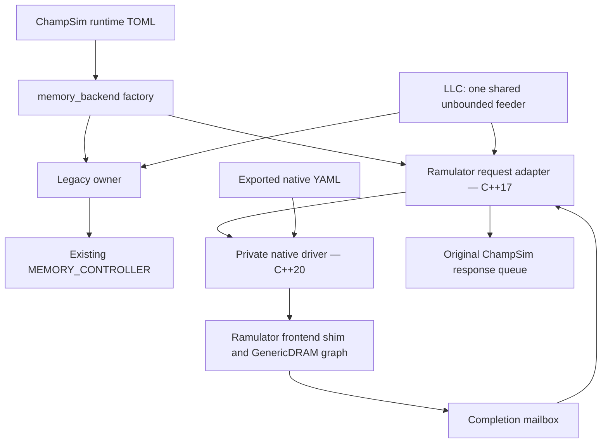

# ChampSim–Ramulator2 integration: design, evidence, and merge-readiness

First written on 2026-09-13 against `8c722681` on `feat/ramulator`. Updated on
2026-09-15 on `fix/ramulator2-review` with an independent review of `74159f1e`
and a pre-merge close-out whose code changes end at `4e1bf028`. Section 3 records
what has run, with revisions and limits; section 4 gives each weak point's status;
section 5 lists what still stands between this branch and mainline.

The integration adds an optional Ramulator 2.1 DRAM timing backend while
retaining the existing ChampSim memory controller. On one shared Linux/GCC 13
host, local tests, code review and the close-out campaigns establish: legacy
bit-identity on the compared workloads; agreement of the production adapter with
an independent model over the real native driver on synthetic traffic at one,
two and four cores; agreement with the pinned native engine at the driver
boundary; no AddressSanitizer or UndefinedBehaviorSanitizer report, and no leak
outside one inside pinned Ramulator, in instrumented simulations and tests that
exit normally (vendored ITTAGE suppressed); exact request accounting and bounded
memory under sustained overload at one core (100M ROI instructions for two
workloads) and in short four-core runs; and reproducible results. They do not
establish hosted-CI or clean-host reproduction, arbitrary Ramulator
configuration or plugin support, fairness on a shared channel, legacy-equivalent
duplicate-read coalition, or physical DRAM accuracy.

The implementation review approved the change with no unresolved Critical or
Important findings; its small replay-comparator finding was fixed in `db25b8cf`.
Fifteen independent evaluators then reviewed `74159f1e`. Review rounds ending at
`3cbb6e2b` fixed most of their confirmed findings; the close-out then added the
differential oracle, an instrumented native build, clock and lifecycle tests and
enforced native counter bounds, and ran the campaigns section 4 had proposed.
Hosted CI has not run on any of these revisions.

## 1. What we integrated

### Runtime and build contract

| Choice | Behavior |
| --- | --- |
| Omit `dram-model`, or set it to `"legacy"` | Use the in-house `MEMORY_CONTROLLER` with its existing timing, queues, warmup and statistics. |
| Set `dram-model = "ramulator2"` | Use Ramulator through a ChampSim request adapter; native YAML owns DRAM geometry, timings and policies. |
| Build with `WITH_RAMULATOR2=0`, the default | No native headers, shared library or native source checkout are required. Selecting Ramulator at runtime fails with build instructions. |
| Build with `WITH_RAMULATOR2=1 RAMULATOR2_ROOT=/path` | The same executable can select either backend. The executable still depends on the native shared library even when a particular run selects legacy. |

The native source is pinned to
`72427a1bba3771564c4fb0e494ba02242fd1eaa7`, **Ramulator 2.1**. The existing external
checkout is used rather than vendoring another copy into ChampSim. The tested
setup is Linux x86-64, GCC 13.3.0 and CMake 3.28.3. Native fmt and yaml-cpp
revisions are also pinned by the build helper.

For example, [configs/ramulator2.toml](../configs/ramulator2.toml) contains:

```toml
dram-model = "ramulator2"

[ramulator2]
config = "configs/ramulator2/ddr4.yaml"
```

Paths resolve from the process working directory. Ramulator 2.1's Python
configuration definitions export fully expanded YAML; ChampSim loads that YAML
directly. Python is used for source metadata and configuration export, with no
Python interpreter or bindings in the simulation loop.

Native mode rejects every explicit `pmem.*` setting, with a diagnostic directing
the user to the YAML. Legacy mode similarly rejects `ramulator2.*` settings.
This preserves strict unused-key validation and avoids silently ignoring an old
configuration. A complete legacy TOML cannot simply be overlaid with a native
selector: remove its `pmem` table and its `sim.deadlock_cycle` key first, or start
from native `--knobs`. A legacy `--knobs` dump or statistics document records the
`sim.deadlock_cycle` its run used, 500 unless set (`configs/sample.toml` sets
1,000), and an explicit value replaces the native no-progress default described
below, so a converted DDR4 configuration can abort inside its first refresh stall.

The initial supported native shape is `External` + `GenericDRAM` +
`CacheLineInterleave`. There must be a nonempty power-of-two number of controllers,
one channel per controller, matching capacity, tCK and transaction size, and the
checked power-of-two geometry/address constraints. The adapter does not translate
every possible native frontend, memory-system architecture or heterogeneous
channel arrangement.

Within that shape, the driver admits only components that can operate behind
ChampSim's External frontend shim. It checks every controller before
constructing any native component:

| Component | Admitted `impl` | Rejected examples, and why |
| --- | --- | --- |
| Controller | `GenericDDR`, `LPDDR5`, `LPDDR6`, `GDDR7`, `HBM12`, `HBM34`, `PRAC` | `BlockHammer` casts the frontend to Ramulator's BHO3 CPU during setup. With the shim that is undefined behavior: a crash or silently inert throttling, depending on memory layout. |
| Address mapper | `RoBaRaCoCh`, `ChRaBaRoCo`, `MOP4CLXOR` | `PassThroughAddrMapper` expects the frontend to fill the address vector and faults at the first tick. |
| Row indirection | `RITAddrMapper` whose nested `addr_mapper` is one of the three above, with `reserved_rows_per_bank` absent or 0 | A nonzero reservation shifts every row up. The top of the capacity ChampSim addresses then lies outside the device, and native throws when a run reaches it. |

The controller names are all of the pinned revision's registered controllers
except `BlockHammer`. Native has no default address mapper, so omitting one is
also rejected. Configurations that reserve rows as the AQUA and Hydra plugin
sources instruct are therefore rejected too. Plugins themselves are not checked.
Admission does not certify a component's policies, only that the driver can
connect it; geometry and timing checks still apply.

Nor does admission check that a controller suits the DRAM model it drives. A
mismatched pair can be rejected by native code (an `LPDDR5` controller over DDR4
fails on an unknown command), stall until ChampSim's no-progress guard aborts
the run (an `HBM12` controller over DDR4 never completes its first request), or
run with the generic controller's semantics (`GenericDDR` over LPDDR5 or HBM3
DRAM completes). The pinned exporter's LPDDR6 organization preset has a 12-bit
`channel_width`, so every stock LPDDR6 export fails the existing byte-aligned
channel-width check; it runs only with that width edited to a multiple of 8,
which changes the modeled device.

Rejections name what was wrong. An `impl` that is not admitted, including a
misspelled or unregistered one, "is not one of the components supported behind
ChampSim's External frontend", followed by the supported list; a negative
`reserved_rows_per_bank` "is invalid; it must be absent or 0"; a component
that is present but not a table "must be a table with an impl key"; an `impl`
given as a sequence or table "must be a single name"; and a table without one
reports "impl is missing". The last three are also followed by the supported
list.

Two reproducible fixtures are included:

| Fixture | Native transaction | tCK | Exposed capacity |
| --- | ---: | ---: | ---: |
| DDR4 | 64 B | 833 ps | 8 GiB |
| LPDDR5 | 32 B | 1,453 ps | 1 GiB |

This is a timing integration. ChampSim still supplies the processor, caches,
translation, traces and upstream response metadata. We did not replace the CPU
with a Ramulator CPU frontend, add functional DRAM data storage, or establish a
new memory-consistency/value-correctness oracle.

### What compatibility means

The legacy owner returns the original controller as the scheduled operable; it
does not insert a new clock stage in front of it. Constructor defaults and argument
ordering were preserved, as were memory capacity handling and the physical-page
allocation algorithm. Old capacity constructors remain available as wrappers.

The root selector adds effective configuration metadata, so historical
configuration fingerprints change even for legacy. The compatibility claim is
exact simulation/statistic equivalence under matched settings, with documented
metadata differences, rather than byte identity of an entire old result file.

Changing native capacity can change ChampSim's physical-page allocation. Changing
native mapping or scheduling changes how memory requests are mapped or served;
it does not itself change the page allocator. Each can affect performance.
Native and legacy IPC are not expected to match. A comparison intended to isolate
DRAM timing must match the rest of the machine and account for these differences.

## 2. How the implementation works

### Architecture and source map



Only one backend and one memory operable exist in a constructed environment. The
owner exposes its operable, capacity, owned statistics and optional configuration
record. Native clock/capacity discovery does not construct a dummy legacy
controller or a second native simulator.

| Responsibility | Main source |
| --- | --- |
| Backend interface and selection | [memory_backend.h](../inc/memory_backend.h), [memory_backend.cc](../src/memory_backend.cc) |
| Preserve the original controller | [legacy_memory_backend.cc](../src/legacy_memory_backend.cc) |
| Environment wiring and page capacity | [static_environment.cc](../src/static_environment.cc), [vmem.cc](../src/vmem.cc) |
| Packet admission, fragments and callbacks | [ramulator2_memory_backend.cc](../src/ramulator2_memory_backend.cc) |
| C++17 driver contract and private native implementation | [ramulator2_driver.h](../inc/ramulator2_driver.h), [ramulator2_driver.cc](../src/ramulator2_driver.cc) |
| Optional build and ABI/library checks | [Makefile](../Makefile), [ramulator2_build.py](../config/ramulator2_build.py) |
| Phase lifecycle and timeout default | [champsim.cc](../src/champsim.cc), [main.cc](../src/main.cc) |
| Counter definitions and reporting | [memory_stats.h](../inc/memory_stats.h), [toml_printer.cc](../src/toml_printer.cc), [plain_printer.cc](../src/plain_printer.cc), [json_printer.cc](../src/json_printer.cc) |

### A request's lifetime

1. The adapter visits the feeder's RQ, PQ and WQ in that order. Within each queue,
   it submits the accepted FIFO prefix. There is no new per-core fairness policy.
2. It validates the source ID and cache-block address, copies the parent packet,
   and assigns an internal parent ID. Callback state exists before the first
   native submission. An invalid source ID, or a non-prefetch request (load,
   RFO, write or translation) whose cache block is not wholly inside native
   capacity, stops the run with an error. An out-of-range `PREFETCH` packet is
   answered or dropped locally instead, as described below.
3. A 64-byte cache block becomes two adjacent transactions for the 32-byte LPDDR5
   fixture, or one transaction for DDR4. With a native transaction larger than
   the cache block, it submits one block-sized request fitting inside that
   transaction; adjacent cache-block parents remain independent.
4. On rejection, the partially admitted parent stays at the queue head. Only the
   unaccepted suffix is retried. A head leaves the feeder only after all of its
   fragments have been accepted.
5. Native callbacks append completion events to a weakly owned mailbox. They do
   not directly erase parent state. This matters because native writes can call
   back synchronously inside `send()`, before it returns success.
6. The adapter commits acceptance bookkeeping, removes a fully admitted head,
   and then processes callbacks. A read returns exactly one response only after
   every fragment completes, using the original packet's response fields.
   Response-suppressed reads still finish bookkeeping. Writes produce no
   unsolicited upstream response.

**How large the backlog grows.** The LLC-to-DRAM feeder channel has no capacity
limit, but in the standard hierarchy the LLC forwards a response-requested miss
only while its MSHR (`cache.llc.mshr_size`, 64) has room, so outstanding reads
stay bounded; writebacks have no such bound. Under rejection floods the overload
campaign (section 3) saw at most 69 live parents at one core and 74 at four. Its
feeder PQ reached 183 entries only after `cache.llc.mshr_size` was raised to
1,000,000, and its writeback queue never held more than 3. A producer that
bypasses the LLC, such as a speculative DRAM read, is not bounded by the MSHR.

**Out-of-range prefetches.** Physical-address caches (L1D, L2C and LLC by
default, where `virtual_prefetch` is false) forward prefetches without a range
or page-boundary check. The shipped `next_line` prefetcher requests the next
cache block and `va_ampm_lite` can request up to 256 blocks ahead; neither stops
at a page boundary. (`ip_stride` and `spp_dev` keep physical prefetches inside
the triggering page.) `VirtualMemory` allocates frames only below capacity, so
once it maps the top physical frame such a prefetch can reach the memory feeder
with a cache block at or past native capacity. Legacy `MEMORY_CONTROLLER` reads
only the address fields its geometry defines and ignores higher bits, so it
aliases the request to an in-range location and serves it with DRAM timing. The
native model has no location to alias, so the adapter never submits such a
packet. When the packet reaches the head of its feeder queue (RQ, PQ or WQ, in
FIFO order behind earlier entries), the adapter pops it and counts it in
`out_of_range_prefetches`. A read with `response_requested` gets the original
packet back immediately, exactly as fast warmup returns reads. A
response-suppressed read or a write gets no response. The handling is the same
in warmup and measured phases and counts as progress. It creates no parent,
native attempt, acceptance, completion, rejection or read-latency sample.
Out-of-range load, RFO, write and translation requests, like invalid source IDs,
still stop the run: `VirtualMemory` places every translated page and page-table
entry below capacity, so one would indicate a bug. Test 705 checks this policy
against a fake driver, and test 706 models it over the real driver (section 3).

The native frontend shim forwards requests while reporting the actual compiled
core count; upstream `External` reports one core. Native controllers, schedulers,
refresh policies, address mapping within controllers and plugins remain native
components. Their behavior is not reimplemented in ChampSim.

### Request coalition differs from legacy

Native mode has no legacy DRAM request queue. `MEMORY_CONTROLLER` is not
constructed, so `DRAM_CHANNEL::RQ`/`WQ` (`pmem.rq_size`/`wq_size`) and their
collision checks (`check_write_collision`, `check_read_collision` in
`src/dram_controller.cc`) do not run. Both backends share only the unbounded
LLC-to-DRAM feeder channel, which merges nothing; the adapter submits its heads
directly, and the native controller's read, write and priority buffers take the
bounded-queue role. Coalition therefore follows native `ControllerBase::send`:

| Case | Legacy | Native backend |
| --- | --- | --- |
| Duplicate reads of one cache block | Merged into the existing `DRAM_CHANNEL::RQ` entry, including one already scheduled and in service: dependency lists and response targets are unioned, and the later read completes when the earlier one does. | **Not merged.** Neither the adapter nor native code deduplicates reads. Each becomes its own parent, native read and response, and pays its own queueing and read latency. |
| Duplicate writes | A duplicate `WQ` entry is dropped; one write remains. | A write whose address is already in the native write buffer is absorbed at `send()` (`num_write_reqs_coalesced`); one write remains. |
| Read of a block with a pending write | Answered from the `WQ` entry in the same operate, with no DRAM time. | Forwarded only if the write is already in the native write buffer (`num_read_reqs_forwarded`); the adapter observes completion in the same operate. |
| Read and write of one block reaching memory in the same cycle | Forwarded: `initiate_requests` moves RQ, PQ and WQ into the DRAM queues before the collision checks run. | Not forwarded: the adapter submits RQ and PQ before WQ, so the read is queued before the write exists (one probe measured 168 tCK instead of 0). |

Neither side compares entries still waiting in the feeder. Legacy has no merge
or forwarding counters, so the two have not been compared on real workloads.

**This matters for speculative off-chip load prediction (Hermes-like
techniques).** Such a technique issues a speculative request that fetches the
data straight from DRAM while the original load walks the cache hierarchy. When
that load misses the LLC, it arrives at the memory controller while the
speculative read is queued or in service. Legacy merges it into the speculative
read, so the load completes with the speculative head start, which is the entire
benefit being modeled. The native backend instead submits a second, independent
read that waits and pays its own DRAM latency, so the technique's benefit would
be understated or lost without any error. The LLC's own miss merging
(`CACHE::handle_miss`, `miss_merge`) does not help, because the speculative
request never passed through the LLC.

Before running such a study in native mode, add legacy-equivalent read
coalition to the adapter: when a read parent is created, attach it to an
outstanding read parent for the same cache block (queued or partially or fully
submitted), union its dependents, fan the completion out to every attached
packet's response queue, and count the merges. Then validate it against legacy
on a Hermes-like request pattern. See the section 4 row for the acceptance
criteria.

### Clocking, phases and finalization

The driver's period comes from integer `tCK_ps` and is cross-checked against the
native public clock API. The selected memory operable participates in ChampSim's
existing global-clock scheduling. Each adapter operation processes pending
completions, admits work while safely handling synchronous completions, advances
one native memory tick, and processes the resulting completions. ChampSim owns
scheduling; native frontend clock ratios do not instantiate another CPU clock.

Fast warmup bypasses fresh native demand submissions while native maintenance
clocks continue. Phase changes clear event counters but retain native queues,
clocks, partial heads and callback contexts. A later warmup does not bypass an
already partially submitted head. The CLI's warmup-then-simulation order cannot
produce that case; tests 706 and 707 exercise it over the real driver.

Each finishing CPU freezes an owned shared-memory ROI snapshot. The last
finishing CPU supplies the final shared-memory snapshot, so its observation
window is not identical to every core's individual window. The difference is
large: in first-wave 4-core runs at `74159f1e`, an early finisher's row in that
snapshot counted 2.5-4.2 times the parents the core issued inside its own ROI
(5.0 times in an 8-core run). Legacy DRAM and LLC per-CPU statistics follow the
same rule. Use per-core IPC, not per-core memory rates, from multi-core
documents. After all phases, finalization runs once with no additional drain
ticks. Outstanding work at retirement is expected and must remain visible in the
report.

A valid DDR4 refresh exposed a too-short inherited no-progress guard:
421 × 833 ps = 350,693 ps exceeded 500 × 250 ps = 125,000 ps. The native default
is now `max(500, ceil(10 microseconds / minimum actual operable period))`:
40,000 global ticks at 250 ps. Legacy keeps 500, and explicit positive
`sim.deadlock_cycle` settings remain authoritative. In native mode an explicit
value whose ticks cover less than 10 µs prints one stderr warning naming the value,
the stall it allows in picoseconds and this machine's native default, and saying
that legacy configurations record the value they used (500 by default); it is not
changed. Idle native ticks do not
pretend to be progress. The 10 µs allowance is a practical default, not a bound
derived from every possible native plugin/device pause. A valid longer pause
passes with a sufficient explicit value (section 3). A lengthened data-bus burst
is such a pause: the default aborted healthy runs at about 13 MB/s of modelled
bandwidth, and ChampSim's separate low-IPC livelock check, which is not scaled
by the simulation quantum, aborted memory-bound traces at 75-300 MB/s. See
[Modelling memory bandwidth](#modelling-memory-bandwidth-with-the-native-backend).

### Statistics and reproducibility

Legacy TOML retains schema 1. Native TOML uses schema 2 with separate
`ramulator2.adapter` and `ramulator2.native` tables under each phase/scope,
plus raw native statistics YAML. Native-only output does not invent legacy
bus-utilization or congestion counters.

Adapter counters describe parent and fragment acceptance/completion, rejected
submission attempts, out-of-range prefetches, live outstanding
parents/fragments, total completed-read latency in picoseconds, and its sample
count. Parent admission and latency start at the **first accepted fragment**.
That latency excludes time waiting in the feeder before any fragment is
accepted. A rejection count measures attempts, not unique rejected requests.

Measured this way, a completed read's adapter latency is one native tick shorter
than native `read_latency` for the same fragment, because native stamps arrival
with the clock before the tick in which the adapter admits it. Without forwarded
reads, `total_read_latency_ps` equals (native `read_latency` - completed reads)
x tCK exactly; the close-out checked this in 64 overload documents, in the DDR4
runs of the clock sweep and per phase in test 707. A read forwarded from a
buffered write records 0 ps and is answered in the operate that admits it.
Native counts such a read as one tick, but pinned Ramulator 2.1 can deliver its
callback hundreds of ticks later when it is queued behind an already issued
read: in a 100M-instruction run, 11 forwarded reads waited 1,956 ticks in total,
exactly the gap between the two statistics. The adapter value is when the
callback fired. Feeder wait is in neither statistic: in first-wave 4-core runs
with 4-entry native buffers, the adapter mean was 113 ns while a probe measured
168-200 ns end to end.

`out_of_range_prefetches` (next to `rejected_submissions` in the adapter table)
is a per-phase event count of `PREFETCH` packets popped because their cache block
is not wholly inside native capacity. Warmup pops are counted too, but reports
cover measured phases only, so like every other adapter event counter a warmup
count is reset at the next phase without being reported. Those packets are
never submitted and do not appear in any other adapter counter or latency
sample. With the shipped prefetchers, a nonzero value means a physical-address
prefetcher ran past the top physical frame. The legacy controller would have
aliased those requests to in-range locations and charged them DRAM timing.

Live gauges include earlier-phase work. Consequently, a phase may complete more
requests than it accepts. Native write completion means the native callback's
command-issue/coalescing event, not that the physical bus has drained. Native
counter definitions and numeric limits are not changed by placing them beside
64-bit adapter counters.

Result metadata archives exact YAML, its normalized absolute path and content
hash, native revision, and library/build identity. Replay reads the current YAML
and checks the expected content hash/revision. It does not extract the archived
YAML automatically, restore traces or run lengths, or prove two different host
binaries are identical. The fingerprints use ChampSim's historical FNV convention;
they are reproducibility identifiers, not cryptographic attestations. In native
mode `build_id` also covers the canonical absolute YAML path recorded as
`ramulator2.config`, so byte-identical YAML at two locations (two checkouts, or
a copy in a sweep directory) gives two `build_id`s. Compare
`ramulator2.config_hash` for content identity. This first-wave finding is not
fixed.

Native scalar paths retain component boundaries and escaped names. Integers are
not rounded through doubles; unsigned values above TOML's signed-64-bit range
become exact decimal strings. Native `ConfigNode` already represents scalar data
as text, so original native type/precision information lost upstream cannot be
recovered by the reporter.

### Native signed-counter bounds

Pinned Ramulator 2.1 keeps a few counters as signed `int`. Since `20430228` the
driver refuses the operation that would overflow one that ChampSim can drive,
with a `std::runtime_error` naming the counter, the limit and the remedy; `main`
prints it and exits 1 without a statistics document:

| Native counter | Supported maximum | Restarts |
| --- | --- | --- |
| GenericDRAM `total_num_read_requests` and `total_num_write_requests` | 2,147,483,647 accepted native transactions of each type per statistics phase. These are transactions, not cache blocks: the LPDDR5 fixture sends two per block, and the refusal can fall between them. Forwarded reads and absorbed duplicate writes count; rejected sends and fast warmup do not. | At every phase begin |
| `int m_clk` in the AQUA, Graphene, Hydra and RRS plugins, when any controller lists one | 2,147,483,647 memory ticks since construction, warmup included: 1.789 s simulated at 833 ps, 3.120 s at 1,453 ps | Never |

Each check is one comparison per send or tick (+0.0088% user-mode instructions on
a 5M-instruction SQLite run, with identical results). An audit of the pinned
source found every other signed native counter on the request and tick path
either bounded by a native reset or threshold, or reachable only after 2^31
accesses of one bank (ClosedCAP, and only with a cap near `INT_MAX` and no
refresh), 2^31 activations of one row or bank (PRAC, IdealTRR, SamsungTRR) or
2^31 all-bank refreshes (TWiCeIdeal); those are not enforced. AQUA, Graphene,
Hydra and RRS also convert their reset period to an `int` tick count through a
float: that is undefined when the period exceeds `INT_MAX` ticks and divides by
zero at the first tick when it is shorter than one tick. Neither is checked.

### Build boundary

Public headers and the adapter remain C++17. Only the private native translation
unit uses C++20. A helper builds the pinned native shared library with Python
bindings disabled, records compiler/dependency/source identity, verifies effective
ABI settings, and invalidates objects on build-mode/compiler/root changes.
A change of host `CPPFLAGS`, `CXXFLAGS` or `LDFLAGS` alone also rebuilds the
native library in its root, although the result is byte-identical.
Runtime checks the identity of the loaded shared object. It asks the dynamic
loader which file it loaded for `libramulator.so`, so PIE and non-PIE executables
fingerprint the same library; CI runs a non-PIE `--knobs` check.

This is a C++ boundary, not a stable versioned C ABI. A compiler/layout probe and
pinned dependencies reduce mismatch risks; they do not certify arbitrary compiler
flags or all operating systems. Native `libramulator.so` is emitted into its source
root even with out-of-tree CMake. Builds and runs sharing that root must be
serialized; there is no cross-process build lock or atomic library publication.
(During the bandwidth study a build in a second checkout replaced the library
under running simulations; eight runs launched at that moment failed to load it.)

`RAMULATOR2_SANITIZE=1` (only with `WITH_RAMULATOR2=1`, added in `1f63c0ee`)
builds the native library `RelWithDebInfo` with
`-fsanitize=address,undefined -fno-omit-frame-pointer` and adds the same options
and `-g` to every host compile and link. The mode is part of the compiler stamp
and the native manifest, so flipping it rebuilds the library and every host
object, and `meta.ramulator2.build` records it
(`RelWithDebInfo C++20 Python=OFF Sanitizers=address,undefined`). The release
path is unchanged: the Makefile change leaves release `make -n` output
byte-identical, and a 0 -> 1 -> 0 flip rebuilt every host object each way and
restored the release library's SHA-256 (`00df468b...`).
Instrumented libraries differ in bytes between roots, and every driver
construction fingerprints the 207 MB library, so tests that construct many
drivers take tens of seconds in this mode.

Updating Ramulator is a deliberate compatibility change. The native class APIs,
source metadata, exported YAML and lifecycle/statistics contracts need to be
rechecked, the pinned revision updated, and fixtures and differential tests
regenerated or rerun. Silently patching the external checkout is not the supported
upgrade path: the build helper rejects modified tracked native source.

## 3. How we tested it

Testing ran in three stages, all on one shared 32-core Linux x86-64 host (Ubuntu
24.04, GCC 13.3.0, CMake 3.28.3) against the pinned native revision, with a
private copy of the native root for every native build. No stage ran hosted CI.

1. **Implementation validation**, to `b5addb74` (tools and docs to `74159f1e`):
   the first rows of the table below and the initial workload envelope.
2. **Independent review** of `74159f1e` on 2026-09-13: 15 evaluators in detached
   worktrees, followed by review-fix rounds ending at `3cbb6e2b`.
3. **Pre-merge close-out**, 2026-09-14 and 15. Implementers branched from
   `3cbb6e2b` for the oracle, sanitizer, counter and clock work, integrated at
   `63c44f38`. Evidence-only campaigns covered sustained overload (at
   `3cbb6e2b`), heavy sanitizer traffic and an independent review (at
   `63c44f38`), and a fix stage for the review's findings ended at `4e1bf028`. A
   bandwidth study (at `3cbb6e2b`) and a refresh study (with a `74159f1e`
   binary) ran alongside.

Detailed counts, commands and the recovery record are in [the validation
record](ramulator2-validation.md); portable commands are in
[test/ramulator2](../test/ramulator2/README.md). Wall-clock figures below come
from the shared host (load average up to about 26), so they are not clean
performance measurements.

| Layer | Recorded evidence | Confidence and limit |
| --- | --- | --- |
| Full regression suites | Enabled: 17,414 assertions, 859 C++ cases passed, one intentional skip. Disabled: 16,988 assertions, 853 passed, seven native skips. Python, in configured trees with `bin/champsim` built: 61 passed enabled; disabled 58 passed and three native-only methods skipped (`OK (skipped=4)`, since one method skips two subtests). | Final production sources at `b5addb74`; integration commits up to `74159f1e` changed tools/docs, not production code. The review fixes after `74159f1e` change production code; see the next row. |
| Suites after the review fixes | Enabled: 17,663 assertions, 867 C++ cases passed, one intentional skip. Disabled: 17,211 assertions, 859 passed, nine native skips. Python: 73 tests, all passed enabled; disabled `OK (skipped=6)`; unconfigured checkout `OK (skipped=18)`. The oracle, integration and tool tests pass. On two short supplied windows, legacy and native DDR4/LPDDR5 output matches the `74159f1e` binaries apart from `meta.command_line` and the new, zero `out_of_range_prefetches` counter. | Local Linux/GCC 13 runs of the review fixes (five production fixes and one Python test fix) applied to `74159f1e`; not hosted CI. Details are in the validation record. |
| Suites after the second review | Enabled: 17,766 assertions, 876 C++ cases passed, one intentional skip. Disabled: 17,309 assertions, 868 passed, nine native skips. Python: 82 tests, all passed enabled; disabled `OK (skipped=6)`; unconfigured checkout `OK (skipped=27)`. The oracle, integration and tool tests pass with unchanged leaf counts. On `706.stockfish_r.sp0`, a no-progress abort with stdout redirected now leaves the full dump, ending with the memory backend's, where it left nothing. | Local Linux/GCC 13 runs of the second review's fixes (`--toml` target resolution and write modes, deadlock diagnostics that survive a throwing printer, native rejection wording, one adapter test) applied to `d3604b51`; not hosted CI. Details are in the validation record. |
| Suites after the close-out | At `63c44f38`, with every close-out branch integrated. Enabled: 891 C++ cases, 890 passed, one intentional skip, 67,974 assertions. Disabled: 891 cases, 873 passed, 18 skipped, 53,018 assertions. Python: 100 tests, all passed enabled; disabled `OK (skipped=8)`; unconfigured checkout `OK (skipped=38)`. `test_tools.py`: 23 tests. After the fix stage (tree identical to `4e1bf028`): enabled 893 cases, 892 passed, one skip, 68,000 assertions; disabled 893, 873 passed, 20 skipped, 53,038 assertions; Python the same (unconfigured checkout not rerun). Test 707 supplies 49,786 of the enabled assertions. | Local runs; not hosted CI. The instrumented runs of these suites are in the sanitizer row. |
| Legacy bit-identity | Implementation: ten comparisons against `79cb5fdb` at one and two cores, all 237/177 and 695/314 phase/config leaves equal. First wave (`74159f1e` against `79cb5fdb`, legacy-only and enabled builds): 89 comparisons over 58,718 phase leaves, 18,245 config leaves and 13,794 stdout lines with no undocumented difference. Close-out (`63c44f38` against `3cbb6e2b`, two supplied traces): 8 legacy and native pairs, 4,176 phase and 1,368 config leaves, zero differences. | Exact, NaN-aware and type-exact. Checked at one and two cores only, on windows of at most 11M instructions per core, with GCC 13.3. |
| Deterministic adapter tests | Test 705 against a fake driver: 195 assertions / 16 cases at `b5addb74`, 436 assertions / 22 cases at `63c44f38`. Covers 32/64/128-byte transactions, retries, same-address parents, synchronous and out-of-order callbacks, metadata, phases, out-of-range prefetches, invalid requests and teardown. | Real adapter queues, deliberately awkward callback schedules; no native timing. |
| Adapter differential oracle | Test 706: the production adapter over the real native driver against an independent model. First wave (harness at `74159f1e`, 1 and 2 cores): about 2,000 seeds, over 20M parents and 500M native attempts, no discrepancy; 17 of 18 mutants detected. Close-out: 1,530 seeds over ten campaigns at 1, 2 and 4 cores, 33,476,840 parents, 893,828,614 native attempts and 13,200 producer-pause recovery cycles with no discrepancy; 30 of 31 mutants detected. | Synthetic traffic enters a channel directly, not through a real LLC. Native accept/reject decisions and timing are trusted inputs. M12 is an equivalent mutant. |
| Sanitizers | First wave (`74159f1e`): host and native library instrumented by a manual library swap; full suites at 1 and 2 cores, the native oracle, both integration runners and real-trace runs report nothing beyond vendored ITTAGE. Close-out: a supported `RAMULATOR2_SANITIZE=1` build. At `63c44f38`, 24 instrumented simulations at 1, 2 and 4 cores (44.7M measured instructions, 53.7M rejected submissions) report nothing and match release builds in every phase and config leaf. Tests 705, 707 and 708 and the oracle campaigns are clean. The full suite passes every assertion but exits 1 on a leak inside pinned native `RITAddrMapper`, from two test 704 cases now tagged `[rit-addr-mapper]` (2,028 bytes in 20 allocations). | The `native_sanitize` CI job's last step fails on that native leak until it is decided (section 4). `abort()`, SIGTERM and SIGINT exits are never leak-checked. No MSan or TSan; vcpkg static libraries and libstdc++ are not instrumented. |
| Direct native versus driver | Identical SEND/CALLBACK streams and all 44 DDR4 / 48 LPDDR5 typed native memory leaves; 22 transactions per device. | Independent callers of the same native engine; the production request adapter is absent from this oracle. |
| Real simulator integration | One- and two-core DDR4, LPDDR5, two-channel DDR4 and changed-clock cases on a generated trace, plus supplied traces and exact typed TOML replay. The same runner passed on a 4-core binary (first wave) and on instrumented 1- and 2-core binaries (close-out). | Real reads, writes, retries, source 1 traffic and live retirement boundaries. Self-replay establishes determinism, not an independent expected packet schedule. |
| Multi-core runs | First wave (`74159f1e`): 28 native 4-core documents, mostly at 3M ROI instructions per core and up to 15M, and 8-core runs at 1M per core; all accounting invariants hold, reruns and replays are identical, and no CPU-id bias appears across core permutations. Close-out: the oracle at 2 and 4 cores, 4-core overload runs, and instrumented 2- and 4-core simulations. | Short 8-core windows; per-core age and tail latency only from uncommitted probes; shared-channel fairness is not guaranteed (section 4). |
| Real traces, long runs and overload | First wave: 5 traces on legacy, DDR4 and LPDDR5 at 10M ROI instructions, and a 100M-instruction DDR4 run whose RSS stayed at 65 MB. Close-out (`3cbb6e2b`): 75 statistics documents from 1M to 100M ROI instructions at one core and at four cores (10M per core at stock timing, 1-2M at about 200 MB/s), all passing exact accounting; 1,687,148,249 rejected submissions; RSS bounded, and every probed backlog drains once input stops. | 100M ROI instructions only for two workloads; no LPDDR5 fragmentation under sustained overload at full-simulator scale. |
| Clocks and epochs | Test 707: a closed-form scheduling reference predicts every tick, submission, completion and response under 10 period sets, with a fake driver and with real DDR4 and LPDDR5 drivers (4 cases, 49,786 assertions). CLI tests recompute the default guard on 9 machines and pass a 13.7 µs native pause with an explicit guard. A real-trace sweep of 36 period configurations replays exactly. | At most six operables in 707, and one core in the sweep; native `clock_ratio` is ignored. |
| Native counter bounds | Test 704 checks, with lowered limits through a test seam, that the driver refuses the send or tick that would overflow a signed native counter (section 2), including between the fragments of a split LPDDR5 block and on either of two controllers. The change leaves 9 SQLite run pairs leaf-identical. | The real limits were not reached end to end. |
| Test-tool negative controls | 11 unit tests after `db25b8cf`; all eight saved original/replay pairs pass the stricter comparator. 23 tests at `63c44f38`; ten deliberate breaks of the new runners each fail a matching test. | Detect changed callback timing, duplicate acceptance, missing/wrong scalar types, integer low-bit loss, absent core traffic, input overwrites, parsing and exit-status errors, and stale mutant patterns. |
| Build/deployment checks | Mode/root/ABI/dependency checks, native example construction, and forced C++17 builds of three standalone tools pass. After a test-only fix, the Python suite also passes locally in an unconfigured, unbuilt checkout using the `python` job's commands: for the 61-test suite at `74159f1e`, 55 passed and six methods that need `bin/champsim` skipped. Later counts are in the suite rows above. Close-out: flipping `RAMULATOR2_SANITIZE` 0 -> 1 -> 0 rebuilds every host object each way and restores the release library; the `native_sanitize` job's steps were run locally. | Local Linux/GCC result. Hosted CI has not run; retaining its 15-entry legacy matrix is not equivalent to executing it. |

### Initial workload envelope

This subsection describes the implementation validation (stage 1); the
subsections after it extend it. The supplied v2 files were SQLite
(`708.sqlite_r.sp0`) and omnetpp (`710.omnetpp_r.sp0`), with `hashed_perceptron`
and `basic_btb` pinned per core. Legacy comparisons used 100,000 warmup /
500,000 ROI instructions and cold 0 / 10,000 windows. Native supplied runs used
500,000 ROI instructions for one-core SQLite and 100,000 per core for the
two-core mixed workload. These are windows from the traces, not full benchmark
executions. The supplied native windows had no writebacks and no outstanding
work at retirement.

The generated tests filled that coverage gap. A 32,768-record, 16 MiB v2 trace
uses one 8-byte memory operand per instruction, 25% stores, and a fixed stride
across a 32 MiB address range. Small L1D/L2/LLC configurations force writebacks.
Each core runs the same generated trace, warming 2,000 and measuring at least
10,000 instructions. Generated ROI duration is approximately **0.09–0.30 ms of
simulated time**, derived from reported core cycles and configured periods.

The two-core LPDDR5 case recorded 5,131 accepted writes, 159,684 rejected
submission attempts, and 34 outstanding parents / 65 outstanding fragments at
retirement. All four two-core cases ended with live parents (39/34/49/43).
This demonstrates stopping without a drain under pending work; it is not a
long-duration resource or fairness test.

The driver oracle is smaller still: 22 source-0 rows, all 32 bytes, one channel,
seven labelled split parents, and native queue capacities of two. DDR4 takes
158 ticks (about 132 ns), LPDDR5 147 (about 214 ns). Attempts/rejections are
1,065/1,043 and 705/683; each produces 22 callbacks, including two synchronous
writes. Split-parent IDs are harness labels, not production adapter contexts.
Stage 1 did not demonstrate real 128-byte native transactions; the review's
differential oracle and the instrumented two- and four-controller simulations
later did.

Stage 1 tested one changed clock configuration: CPU 2,500 MHz, LLC 1,000 MHz and
L2 1,500 MHz with DDR4 still at 833 ps. The close-out's test 707 and clock sweep
extend it.

### Independent differential oracle for the adapter

Test 706 runs the production adapter over the real native driver behind a logging
decorator. An independent model written from section 2 predicts every native
attempt (address, core, size), where each queue stops, each upstream response and
its metadata, `operate()` progress, and every adapter counter and gauge; native
accept/reject decisions and callback timing are its inputs. Traffic is synthetic:
repeated and hot addresses, response-suppressed reads, writes, bursts larger than
native buffers, idle gaps and out-of-range prefetches in all three queues, across
warmup, a zero-length measured phase, staggered per-CPU ROI ends, a later warmup
holding partial heads, and a drain or a finalization with live work. Each campaign
run first checks 46 invalid requests per YAML that must stop the run before any
native attempt. The recovery campaign overloads tiny buffers, stops the producer
and requires full quiescence (empty queues, zero gauges, balanced counters, a
callback for every accepted request and no callback closure left below the
driver) before the next burst. The YAML variants add tiny buffers, two and four
controllers, asymmetric buffers, interleave bits 2, 128-byte transactions and two
feeders to the two fixtures. To rerun the campaigns and the mutation check, use
`oracle_variants.py`, `run_differential.py` and `run_mutants.py` as described in
[test/ramulator2](../test/ramulator2/README.md#adapter-differential-oracle-test-706);
the validation record lists the exact commands.

| Campaign | Build | Result |
| --- | --- | --- |
| First wave, untracked harness at `74159f1e` | 1 and 2 cores | About 2,000 seed runs, over 20M parents and over 500M native send attempts: no discrepancy. 17 of 18 mutants detected; M12 is equivalent |
| Differential, 12 runs x 10 seeds x 10,000 parents | 1 core | 120 seeds; 1,305,584 parents; 30,979,923 attempts; 1,633,679 accepted fragments; 1,669,296 rejections of partial heads; 57,406 synchronous callbacks; 637,406 responses; 53,142 out-of-range prefetches |
| The same | 2 cores | 120 seeds, identical totals; accepted fragments by core 816,956 / 816,723 |
| 6 runs x 10 seeds x 10,000 parents | 4 cores | 60 seeds; 652,187 parents; 19,471,302 attempts; accepted fragments by core 216,423 / 216,061 / 216,031 / 216,330 |
| Recovery, `DIFF_CYCLES=40` | 1 / 2 / 4 cores | 240 / 60 / 30 seeds; 9,600 / 2,400 / 1,200 cycles, every one overloaded; quiescence holds at every pause |
| Further campaigns | 1 core | Finalization without drain (120 seeds); counters compared after every operate (1,439,043 comparisons); seeds 11-60 (600 seeds); 10 seeds x 100,000 parents (120 seeds, 309,404,766 attempts) |
| `run_mutants.py` on a copy of `f2ca5f96` | 2 cores | 31 mutants of the adapter and driver: 30 detected, M12 equivalent. M19 (every fragment sent as core 0) is also equivalent at 1 core |
| Instrumented (`RAMULATOR2_SANITIZE=1`) at `63c44f38` | 1 and 2 cores | 10 x 10,000 differential and 40-cycle recovery campaigns pass with no sanitizer report |

The ten close-out campaigns total 1,530 seeds, 33,476,840 parents, 893,828,614
native attempts, 13,200 recovery cycles and 4,554 invalid-request cases, with zero
discrepancies. Their binaries were built at `6c3e409d` on the oracle branch, whose
production sources are those of `3cbb6e2b`; the branch was integrated as
`9047baec`..`3dcce080`. The non-hidden smoke case (about 1.3 s) runs in every
enabled `make test`; the close-out review found that the smoke case alone
detects 29 of the 31 committed mutants at one core (all but M12 and M19) and
all 11 further mutants the review wrote.

Limits: traffic enters a channel directly, not through a real LLC and core; native
decisions and DRAM timing are trusted, not checked; a parent leaked before any of
its fragments is accepted, with no queue head naming it, is visible neither to the
model nor to LeakSanitizer; no 8-core build ran; and partial acceptance split
across two channels is rare (1,076 such rejections in the 1-core differential
campaign).

### Native sanitizer coverage

**First wave, `74159f1e`.** No supported instrumented native build existed, so
an evaluator built an instrumented `libramulator.so` (ASan and UBSan,
`RelWithDebInfo`), swapped it into private roots and patched the manifest, with
the host at `-O1` and sanitizers. The full Catch2 suite passed at one core (860
cases, 859 passed, one skip, 17,414 assertions) and two cores, as did the native
oracle, both integration runners, v2 real-trace windows of 2.1M instructions,
small-cache runs with tiny native buffers, two controllers, CommandCounter and
CmdTraceRecorder, teardown with live requests, and native construction errors.
Under the standard options the only reports came from vendored ITTAGE. Its
documents' `meta.ramulator2.build` still said Release, and its lifecycle
harness's callback-copy check could never fail (test 708 corrects it).

**Close-out, supported path.** `RAMULATOR2_SANITIZE=1` (section 2) was added with
test 708 and a `native_sanitize` CI job. Negative controls: a driver that leaks
native state unless finalized fails 708 in a release build (67 live callback
copies); a use-after-free in the adapter passes release 705 and 708 but is
reported by instrumented 708 as a heap-use-after-free at
`src/ramulator2_memory_backend.cc:206`.

**Heavy traffic at `63c44f38`.** 1-, 2- and 4-core instrumented binaries ran 24
simulations with the CI job's options: write-heavy 777.zstd_r, 735.gem5_r and
462.libquantum at 3M ROI instructions on DDR4 and LPDDR5; saturation at nBL 381
with 1- and 4-entry native buffers (3.9M-31.4M rejected submissions per run); two
and four controllers with interleaving, 128-byte transactions and the
CommandCounter and CmdTraceRecorder plugins; an out-of-range prefetch run; and 2-
and 4-core mixes split by trace version. Together they measured 44,700,055
instructions, with 2,023,106 accepted reads, 459,824 accepted writes, 3,536,932
fragments, 53,664,906 rejected submissions and up to 42 live parents at exit. No
sanitizer report, and every phase and config leaf equals an unsanitized build's
(`meta` differs in `command_line`, `ramulator2.build` and
`ramulator2.library_hash`); the 12 plugin output files are byte-identical. The
full suite passes every assertion at one core (891 cases, 890 passed, one skip,
67,975 assertions) and at two, then exits 1 on the `RITAddrMapper` leak alone.

**CI job.** After the fix stage, test 704's two `RITAddrMapper` cases carry the
tag `[rit-addr-mapper]`. Run locally with the job's shell and environment on the
`4e1bf028` tree, the main test step (704-708 without the tag) passed 50,742
assertions in 45 cases and exited 0, the instrumented simulation step exited 0,
and the last step passed 16 assertions in 2 cases, then exited 1 on 2,028 bytes
in 20 allocations, all under `RITAddrMapper::create_base_mapper()`. That native
function creates its nested mapper without adopting it. The leak is deliberately
unsuppressed.

**Not covered.** LeakSanitizer never runs on the no-progress guard's `abort()`,
SIGTERM or SIGINT; with 1 and 6 live parents, and mid-run signals, those exits
printed nothing. With `handle_abort=1`, AddressSanitizer reports the deliberate
abort as an error. Uncaught exceptions and the simulation-phase runtime-error
exit were not re-exercised at `63c44f38` (a first-wave check at `74159f1e` of an
error exit during simulation with live native state was clean). At 200 MB/s the
multi-core ROI was cut to 250,000 or 100,000 instructions per core at two cores
and 50,000 or 100,000 at four; no 8-core build; no MSan, TSan or
`_GLIBCXX_ASSERTIONS`; RIT/VRR mappers and RowHammer plugins only through test
704; out-of-range prefetches in simulation produced one event (test 706 supplies
bulk coverage). Instrumented runs cost 20-30 times release wall time and up to
1.35 GB RSS.

### Multi-core runs

First-wave 4-core runs at `74159f1e` used a v2 mix (ns3, zstd, abc, omnetpp) on
legacy, DDR4 with one, two and four controllers, LPDDR5, and LPDDR5 with 4-entry
buffers, in up to five permutations; 8-core runs used 1M ROI instructions per
core. Every native document (28 at four cores, 4 at eight) satisfies parent and
fragment conservation, native requests = accepted fragments and per-core counter
sums; reruns and a replay from the run's own document give byte-identical phase
sections, and `run_integration.py` passed at four cores. Across a Latin square
of core assignments, the mean per-trace IPC spread was 1.78% (DDR4) and 1.82%
(LPDDR5) against 2.95% for legacy. With 4-entry LPDDR5 buffers and a `next_line`
LLC prefetcher, prefetch requests waited 0.95-1.32 µs on average (up to 6.37 µs)
in the feeder against 67-81 ns for demand reads, because demand reads take every
freed native read-buffer slot first; omnetpp lost 22% IPC to the prefetcher,
against 26% for legacy with `pmem.rq_size=4`. No statistic shows that wait.

In the close-out, four cores sharing one 200 MB/s channel stayed balanced for
four copies of libquantum (45,248-45,929 native reads each), but a mix of
libquantum, mcf, roms with `next_line` and cactuBSSN finished with 238,465,060
rejected submissions and per-core reads of 31,538 / 57,103 / 152,694 / 306,044.
Test 707's harness also saw GenericDDR, a native policy, serve 7 of 39 reads
while writes kept its write buffer refilling. Two scheduling facts are not
covered by a reference. `do_cycle` orders operables with `std::sort`, which in
libstdc++ keeps environment order among equal times only below 17 elements;
every machine with two or more cores has at least 18, so the per-tick order of
equal-time cores, caches, walkers and memory is not the documented environment
order. It is deterministic, predates the integration and affects both backends.
And per-core request age and tail latency were measured only with uncommitted
probes.

### Real traces, long runs and sustained overload

The first wave ran the main checkout's enabled one-core binary at `74159f1e` on
five traces (708.sqlite_r, 735.gem5_r, 777.zstd_r and 723.llvm_r in v2,
462.libquantum in v1) on legacy, DDR4 and LPDDR5 at 1M warmup / 10M ROI
instructions. All 15 finished; accounting invariants held in every document; LLC
issued reads equalled adapter accepted reads, within one in flight at a boundary,
in 17 documents; three identical runs and replays from another directory matched.
735.gem5_r.sp1 at 5M warmup / 100M ROI on DDR4 kept RSS between 65,016 and 65,356
KiB over 70 samples; at matched 8 or 16 GiB capacity, legacy and native LLC load
misses differed by 1.9% and 0.3%.

The close-out overload campaign ran at `3cbb6e2b` (native one- and four-core and
legacy one-core `-O3` builds; 76 simulations in five hours, at most eight at once)
at native nBL 381 (about 200 MB/s), nBL 92 (about 800 MB/s), stock timing, and
stock timing with 1-, 2- and 4-entry native buffers:

| Question | Result |
| --- | --- |
| Accounting | All 75 documents pass: 69 native ones pass 14 invariants (parent and fragment conservation, latency samples, native requests = accepted fragments, write completions = native served + coalesced, per-core sums, the latency identity of section 2) and 6 legacy ones the 2 generic checks. 25,317,170 accepted fragments and 1,687,148,249 rejected submissions |
| Memory | libquantum at 200 MB/s for 100M ROI instructions: RSS 127.2 MiB at 1M, 127.7 MiB at 30M and at 100M. A rejection flood (654.roms_s with `va_ampm_lite`, 821.7M rejections in 50M instructions) grew 127.3 -> 129.8 MiB, close to legacy's rate for the same workload (524 against 436 KiB per 10M instructions); an instrumented copy attributes the growth to VirtualMemory's page map (74 B of heap per newly mapped page) while every backlog peaked by about 4M instructions. All 14 instrumented drains ended with no parent, callback closure, feeder entry or native buffer entry, after one response per outstanding LLC MSHR entry |
| Throughput | libquantum 100M: 286k, 270k, 261k, 266k and 286k simulated cycles per host second over its 1-2M, 2-10M, 10-30M, 30-50M and 50-100M windows; identical repeats differed by up to about 20%, the host-noise bound. At equal bandwidth native simulated 0.5-34% more cycles per second than legacy with 2.1-2.5 MiB more RSS; native/legacy IPC 0.962-1.027 |
| Not reached | 100M only for libquantum and zstd; roms stopped at 43M for time, the flood at 50M, write-heavy 605.mcf_s at 10M; four-core runs at 200 MB/s cut to 2M and 1M per core; every run used 64-byte DDR4 transactions, so multi-fragment heads under sustained rejection were not exercised at this scale |

### Clocks, epochs and the no-progress guard

Test 707's reference is closed-form and shares no code with the simulator: an
operation of period P runs on global tick floor((m-1)P/q)+1, ordered by time and
then environment order. Under 10 core/cache/native period sets (dividing,
non-dividing, equal and extreme, from 11 ps to 30,011 ps), native latencies of 1
and 5 ticks and three first-ROI lengths, a fake driver's every tick,
submission, completion, response and per-phase counter matches it, and ROI
snapshots stay frozen through a later phase. With the real DDR4 and LPDDR5
drivers every native tick matches the reference, and per-phase counters, gauges,
native cycles, latency origins carried across a later warmup, LPDDR5 blocks split
across it, and finalization once without a tick match a recomputation from the
driver boundary. Seven source mutations
(operating a period late, unsorted operables, reset latency origins, a missing
completion pass, a finalization tick, a warmup that resends a refused half, an
off-by-one mailbox time) each fail it, as did the close-out review's own clock
mutants; returning live statistics as the ROI snapshot fails it since `cf9eb618`.

`test_ramulator2_cli.py` recomputes the default guard from `--knobs` frequencies
on nine machines (40,000 ticks at stock; 12,005; 6,883; 38,911 with a 257 ps
core; 70,423 with a 142 ps walker; 10,000,000 with a 1 ps LLC; the 500 floor)
and requires explicit values to stay unchanged. With
`test/ramulator2/ddr4_nbl16384.yaml` it requires the default to abort a valid
13.7 µs closed-row read and two explicit guards to finish with identical
statistics. By bisection the largest aborting explicit guard is 54,698 ticks:
54,698 x 250 ps = 13,674,500 ps falls 28 ps short of one such read (16,416 x 833
ps), so an explicit guard counts exactly the stall.

A real-trace sweep (708.sqlite_r and 777.zstd_r, 1M warmup / 5M ROI, DDR4 and
LPDDR5, nine core/cache/LLC period sets from 119 to 4,359 ps including 300/257/997
ps) ran 36 configurations, 36 self-replays and 2 repeats, all exiting 0 with the
accounting invariants, a native window within one tick of the core's, and every
phase and config leaf replayed type-exactly. Zero- and one-instruction ROIs are
exactly one global tick. The sweep found three behaviours no test pins:
`vmem.minor_fault_penalty` is 200 quantum ticks, and the quantum stops shrinking
at tCK, so once cores are slower than the native clock the fault penalty stops
scaling with them (SQLite time per instruction 2-8% below its linear trend); a
native `clock_ratio` of 3 or 4 is accepted and changes nothing; and `-i 0` still
runs one tick.

### Refresh study

A suspected thousand-fold refresh-interval unit error in pinned Ramulator was
refuted from the source history, JEDEC JESD79-4 and vendor datasheets: the DDR4
fixture's nREFI of 9,363 cycles at 833 ps is 7.80 µs, and LPDDR5's 2,688 at
1,453 ps is 3.906 µs, the normal-temperature averages for 64 ms and 32 ms over
8,192 commands. With a `74159f1e` one-core binary on 605.mcf_s, 708.sqlite_r and
710.omnetpp_r (10M warmup / 50M ROI), stretching the interval a thousand-fold
raised IPC by 0.07-5.45% and roughly halved p99 read latency. Reads overlapping a
refresh were 1.1-3.8% of reads but 97-100% of those above p99. Native AllBank
refreshes on a fixed cadence without JEDEC's postpone and pull-in. The study
found that legacy truncates its own interval (section 4).

### Problems found and corrected

The test process found and corrected an ABI-compatibility gap, lost dependency
edges in non-executing Make modes, the premature DDR4 no-progress abort, and a
replay helper that treated `1`, `1.0` and `True` as equal. Their tests and fixes
remain in the repository.

The review and close-out found and corrected, among others: out-of-range
physical prefetches that stopped native runs (now answered or dropped, section
2); controller and mapper components the External shim cannot serve (now
rejected before construction); a library check that fingerprinted a non-PIE
executable instead of `libramulator.so`; a native deadlock dump lost to
unflushed stdout at `abort()`; native operations that could overflow signed
native counters (now refused); a lifecycle check whose callback-copy counter
could never fail (corrected in test 708); a sanitizer CI step in which the known
native leak hid any new one (now split by tag); and two test gaps, in which
breaking plugin-clock detection on a second controller or ROI-snapshot freezing
went unnoticed (tests 704 and 707 now catch both).

A separate validation command also exposed destructive optional-output argument
handling: `--toml=` consumed the SQLite input pathname as an output and truncated
it before input-count validation. The original 327,181,771-byte file was recovered,
verified against its exact catalog SHA-256 and compressed-stream integrity, and
restored. Subsequent empty-input crashes were excluded from native evidence.
The CLI then checked input count and filesystem output/trace aliases before
opening output. A later review found two cases that check missed: one trace path
more than the binary had cores still let `--toml` consume and overwrite a trace,
and the startup probe truncated a `--config` source, the native YAML or a results
document before a configuration error. A named output is now never written at
startup, and an existing non-empty regular file that does not begin like a
statistics document is refused. A second review found that the checks read the
name as typed while the write used a textual `..` fold, so
`missing/../machine.toml` replaced the configuration; every check now uses the
file the kernel reaches. It also found that `--toml /dev/stdout` with stdout
redirected to a log replaced the log; the file behind stdout or stderr now
receives the document on that stream. Those versions replaced a regular target
by renaming a finished sibling over it, and each of three reviews found
something the rename did that writing the file would not (a split hard link, a
new file's group, ACL or permissions, a refused long name or read-only
directory) or a document it lost, so the rename was removed. The target is
checked at startup without being modified, checked again after a successful
run, and written in place: existing files keep their inode, links, owner, group,
ACLs and permissions, and new files get default permissions. Two guarantees are
given up. A failure during that final write itself, such as a full disk, can
leave the target empty or partial, and the error says so. And the write is not
atomic: another run writing the same name at the same moment, or anyone reading
it, can see an empty or mixed document. Runs launched together at one new name
are not refused at startup, because each check repeats when the name appears
or vanishes while it is being checked. An
existing output that may be written but not read is accepted when empty and
refused as unreadable otherwise. Tests use
named `--toml FILE -- TRACE` arguments, scratch inputs and checksum checks. See the
[recovery record](ramulator2-validation.md#validation-input-incident-and-recovery)
for the hash and original evidence.

### Modelling memory bandwidth with the native backend

A bandwidth study at `3cbb6e2b` measured how to set a DRAM data-bus bandwidth
natively, how far the setting can be trusted, and what else must change. It used
one- and four-core `-O3` enabled binaries, the DDR4 fixture's organization and
timing (DDR4_8Gb_x8, DDR4_2400R, tCK 833 ps, one rank, one controller, 64-byte
transactions, 8 GiB), a harness that drives each backend alone with 64 pending
64-byte reads, and end-to-end single-trace windows of 0.1-10M instructions.
Everything below is scoped to that setup.

**The knob.** Override the burst length `nBL`, which sets the channel's RD-to-RD
and WR-to-WR spacing, and export with the pinned exporter. The committed
[`test/ramulator2/ddr4_nbl16384.py`](../test/ramulator2/ddr4_nbl16384.py) is the
fixture with only `nBL` changed:

```sh
PYTHONPATH=/path/to/ramulator2/python python3 -m ramulator export bw.py -o bw.yaml
```

Every other timing stays fixed in cycles, and every read's latency grows by
`nBL` x tCK, as it grows by one transfer time with legacy `pmem.data_rate`.

**Expected bandwidth.** Bandwidth ~= 76,831 x A / nBL MB/s, where
76,831 = 64 bytes / 833 ps in MB/s and A is the share of time refresh leaves the
channel available: measured 0.95 for nBL 8-32, 0.958 at 64, 0.978 at 256 and
1.000 from 512. Harness throughput matched this from nBL 8 (9.1 GB/s) to nBL
2,048 (37.5 MB/s), with random, sequential and write traffic within about 2%;
end to end, a saturated single-core 605.mcf_s window reached 95% of 76,831 / nBL
at nBL 256, 99% at 1,024 and 100% from 4,096 to 65,536 (1.17 MB/s). At nBL 6 and
below, random reads stop at about 11.2 GB/s, limited by the ACT window and one
command per tick rather than by `nBL`. Steps are integers (nBL 12 -> 11 is +9%).

Calibrated points, random reads in the harness:

| Target MB/s | Native `nBL` (measured MB/s) | Legacy `pmem.data_rate` with `pmem.bankgroups=4` (measured MB/s) |
| ---: | --- | --- |
| 100 | 768 (100.0) | 13.035 (100) |
| 200 | 381 (199.9) | 26.072 (200) |
| 400 | 186 (400.9) | 52.036 (400) |
| 800 | 92 (802.1) | 104.069 (801) |
| 1,600 | 46 (1,596) | 209.864 (1,605.4) |
| 3,200 | 23 (3,183.9) | 419.968 (3,159.3) |
| 6,400 | 11 (6,648.2) | 856.524 (6,348.5) |
| 12,800 | 6 with `nFAW` 24, not JEDEC (12,158.6) | 1,831.5 (13,439) |

Neither backend reaches 25.6 GB/s of random reads on one channel (native stops at
about 17.2 GB/s even with every spacing relaxed); use two or more controllers.
The legacy column matches measured random-read throughput. Matching bus time per
64-byte block instead gives `pmem.data_rate` ~= 9,604 / nBL, which the stress,
per-core and overload runs used. Absolute results of the two backends agree only
where the bus dominates (section 4).

**Guards.** Add `--set sim.livelock_period=1000000000000`, or any period longer
than the phase, to every low-bandwidth run: ChampSim's IPC < 0.01 abort fired on
605.mcf_s in both backends at 100 MB/s and natively at 75 MB/s, and on 621.wrf_s
at 300 MB/s; a longer finite period (4e7 ticks) only delayed it. The native
no-progress default sufficed in every run at 200 MB/s and above, but in windows
with writes the longest silent stall was about 2 x nBL + 900 cycles: nBL 5,500
(14 MB/s) finished at 39,660 of its 40,000 ticks and nBL 5,800 (13 MB/s)
aborted. The study's rule, with a four-fold margin over that stall, is
`sim.deadlock_cycle = max(40000, ceil(4 x (2 x nBL + 900) x tCK_ps /
quantum_ps))`; it was validated only at nBL 5,800 (166,600 ticks). Legacy's
default of 500 aborted at `pmem.data_rate` 64 (512 MB/s of bus rate) and below;
the sweep and overload runs used 400,000.

**Knobs not to use.** Scaling tCK gives the same throughput, but rounds every
timing up, leaves nREFI and nRFC at the preset's cycle counts unless set, and
gave 6.5-10.7% lower IPC end to end than `nBL` at equal bandwidth. A smaller
transaction payload moves in powers of two, changes capacity and per-block
latency, and gave 4-19% lower IPC near stock bandwidth. Extra controllers with
32-byte transactions produced statistics identical to one controller with
64-byte ones: capacity doubles, bandwidth does not. With 64-byte transactions
extra controllers do add bandwidth, not linearly (two and four gave 1.76 and
2.63 times on 605.mcf_s at nBL 256). For DDR5 also override `nRTW` (`nBL + 8`
for DDR5_5600B), and after any timing override compare the exported timing list
with a recomputation of the timings derived from it (section 4).

**Per-core bandwidth.** One core on a channel of bandwidth B/N stands in for N
cores sharing B only when the shared channel is saturated and every core runs the
same workload. Against four cores sharing a channel of 4B, with the LLC scaled
per core, single-core per-core IPC was within 2% for 605.mcf_s at 1.2 and
0.3 GB/s per core and for 462.libquantum at 0.3 GB/s. It was off by 9.6% for
libquantum at 1.2 GB/s (its single-core channel only 84% utilized), by 33.5% for
mcf at 4.8 GB/s per core (the shared channel at 43% of capacity), and by 8-124%
per core for a four-benchmark mix. An L2C `ip_stride` geomean speedup changed
sign (0.938 shared, 1.062 emulated). Leaving the shared LLC unscaled added about
12%. In a paper, describe such a sweep as one core with a dedicated channel of
bandwidth B_core (`nBL` = 64 B / (B_core x tCK)) and all other DDR4 timings and
capacity unchanged; report the channel's utilization,
(`read_throughput_MBps` + `write_throughput_MBps`) / (76,831 / nBL), beside each
point; state that it models no contention among cores sharing a channel; and back
claims about shared channels, heterogeneous mixes or prefetching with N-core
runs. For prefetcher studies also report native `rejected_submissions` and
`queue_len_avg`: at 200-1,600 MB/s, 654.roms_s with `spp_dev` kept the 32-entry
native read buffer full (average queue length 32.8-33.4). `spp_dev` itself reads
past a vector (`prefetcher/spp_dev/spp_dev.cc:77`), which aborted four native
runs and made results depend on command-line length; the later campaigns used
`next_line`, `ip_stride` or `va_ampm_lite` instead.

## 4. Weak points and the stress tests they need

The following are known constraints or unproven coverage, not a claim that every
row represents a demonstrated integration bug. The first twelve rows are the
agenda as written before the close-out; their weak-point text describes that
time. The last six rows come from the bandwidth and refresh studies. The status
of every row after the close-out follows the table.

| Priority / surface | Weak point | Proposed experiment and acceptance criterion |
| --- | --- | --- |
| Before merge: independent adapter/native oracle | The strongest native differential test bypasses the adapter; full simulator replay uses the same implementation twice. | Feed the production adapter through the real driver, log native attempts/callbacks with a test-only decorator, and independently predict fragmentation and upstream parent responses. Start with 10 deterministic seeds × 10,000 parents, tiny buffers, source 0/1, repeated addresses, suppressed reads and phase boundaries. Require exact accepted streams, one correct response per requested read, no duplicate accepted fragment, and response only after the last fragment. |
| Before merge: native sanitizer coverage | Native allocation, controller/plugin lifetimes and the real callback path were outside the instrumented fake-driver harness. | Build compatible host **and native library** with ASan/UBSan and leak checks; run the native-backed oracle, generated simulations, repeated construction/destruction and termination with live requests. Require no sanitizer reports and unchanged deterministic results. The current helper strips inherited native compiler flags and builds in Release mode, so host sanitizer flags alone are insufficient: add a supported instrumented native build path with matching provenance. |
| Before merge: sustained overload and recovery | The shared feeder is intentionally unbounded; rejection retains work rather than providing a new finite LLC backpressure boundary. Pending parents/forwarded native requests and snapshots consume memory and allocation time. | Progress from 1M to 100M ROI instructions on selected read/write/prefetch-heavy workloads, plus repeated producer-pause recovery in a request harness. Sample feeder/parent/native/response depths, RSS and simulation throughput. Require exact completion accounting and recovery of live objects after input stops; distinguish overload backlog and allocator retention from leaks. Do not require constant RSS under unlimited offered load. |
| Before merge: interference and larger machines | Only 1/2 cores and 1/2 homogeneous channels were exercised. RQ/PQ/WQ order adds no fairness quotas, and global progress can hide one request or core starving. | Use 4/8-core builds and 1/2/4 channels with asymmetric row-hit versus row-conflict traffic, read/write mixtures, prefetch floods, hot channels and staggered completion. Require all finite workloads to finish under declared bounds; inspect per-core progress, maximum age and tail latency. Compare native submission traces before attributing native-policy effects to the adapter. |
| Before merge: clocks and epochs | One frequency combination and selected phase transitions do not cover all quantization, refresh or pending-callback boundaries. The 10 µs timeout is heuristic. | Sweep core, cache and native periods, including non-dividing periods and long idle/maintenance intervals; test zero/short ROIs and real partial heads across phase changes. Require tick/response visibility agreement with an independent scheduling reference, unchanged explicit guards, preserved latency origins, immutable snapshots and no finalization ticks. A valid pause longer than the default must pass with a suitable explicit override. |
| Before merge: native counter limits | In pinned native `memory_system/impl/generic_dram_system.cpp`, top-level accepted-read and accepted-write counters are signed `int`. On the tested host, incrementing either beyond 2,147,483,647 between resets overflows signed arithmetic. Adapter `uint64_t` counters do not prevent this. | Exercise a targeted near-limit native counter fixture under UBSan and define the supported maximum phase request count. Promote/check affected upstream counters, or enforce and document a supported bound before claiming arbitrarily long phases. Count native fragments, not cache-block parents; inspect plugin/controller counters separately rather than assuming identical types. |
| Before merge: hosted/clean-host checks | Local dependencies were reused; the hosted matrix has not executed. C++ ABI probing is useful but not an exhaustive portability guarantee. | Run hosted native/legacy jobs on the intended merge revision and reproduce from a clean supported host. Test mode/root/compiler changes, interrupted builds, missing/substituted libraries and loader paths. Require correct rebuilds, useful rejection of incompatibilities and no native dependency in disabled builds. Keep shared-root concurrent builds unsupported unless locking/publication is implemented. |
| Before broader device support: native YAML and plugins | Common geometry/table validation is not a complete semantic validator for every native component. Only two presets were exercised, with clock-ratio fields set to one. | Test each intended DRAM/controller/refresh/mapper/plugin combination, actual 128-byte transactions, boundary addresses, capacities and interleave shifts. Fuzz malformed tables and component parameters in subprocesses with time/RSS limits. Valid supported cases must progress and match native references; invalid cases must fail clearly rather than crash or hang. Explicitly settle non-default clock-ratio semantics before advertising them. |
| Before broader plugin support: epochs and file outputs | Native plugins own their reset/update/finalize behavior. Some open files during construction or finalization; ChampSim's TOML-versus-trace checks do not sandbox those paths. | Exercise counter, trace-recording and stateful plugins through multiple phases, pending finalization and output errors, using dedicated scratch paths. Verify each plugin's epoch/state contract and closed/error-checked outputs; test intended output paths independently of the CLI protection. |
| Before speculative off-chip load studies (Hermes-like): duplicate-read coalition | Legacy merges a demand read into an outstanding DRAM read for the same block, including one in service. The native backend does not, so a speculative DRAM fetch and its demand load are served as two independent native reads. Same-cycle read-after-write forwarding also differs, because the adapter submits RQ/PQ before WQ. See [Request coalition differs from legacy](#request-coalition-differs-from-legacy). | Implement adapter-level read coalition for outstanding parents of the same cache block, with a merge counter, and optionally legacy-order write forwarding. Unit-test merges into queued, partially submitted and in-service parents, response fan-out, and dependency unions. Then drive a Hermes-like pattern (a speculative DRAM read followed by the same block's LLC miss at a controlled delay) through legacy and native mode. Require the demand load's completion to track the speculative read in both, and report merge counts beside native `forwarded`/`coalesced`. Instrument legacy merges so the counts can be compared on real traces. |
| Before performance conclusions: model fidelity and host overhead | Native agreement proves that the wrapper uses the same engine consistently; it does not validate that engine/preset against hardware. No systematic simulator overhead study was performed. | Match capacities, mappings and controller settings, validate native command traces against an independent supported reference, and compare latency/bandwidth trends with a declared calibration method. Separately profile adapter allocation, queue walks and snapshot costs. Define tolerances and a practical resource budget before interpreting results. |
| Before durable sign-off: evidence retention | Most raw baseline outputs, binaries, logs and exact command/provenance records remain under `/tmp`; some baseline helpers are not committed. | Preserve a versioned evidence bundle and verify the public deterministic subset from a clean checkout. Require manifests with revisions, commands, dependency/compiler/Python identities, input hashes, expected results and checksums; keep restricted trace inputs separate. |
| Before comparing backends: row locality | Native `RoBaRaCoCh` keeps row and bank in high address bits, so neighbouring cache blocks share an open row. Legacy's slicer puts bank group and bank just above the 64-byte block offset, so neighbours rotate across 16 banks. In the one-core bandwidth sweep at `3cbb6e2b` (10M ROI instructions, no prefetcher), native row hits were 45-52% on 654.roms_s, 76-88% on 727.cppcheck_r and 5-7% on 605.mcf_s, against 0-9% for legacy on all three. Native/legacy IPC was 0.986-0.993 at 200 MB/s, 1.033-1.144 at 800-1,600 MB/s, 1.101-1.388 at 6,400 MB/s and 1.050-1.442 at stock timing, which is not bandwidth-matched; `spp_dev` speedups differed by up to 8 points at 1,600 MB/s. Row-hit rates were measured; the cause is inferred from the code. | Compare results within one backend and name it. To attribute the gap, rerun at matched bandwidth and capacity with a legacy layout that keeps neighbouring blocks in one row, or a native mapper that rotates banks, and separate the contributions of core timings (legacy 24 x 625 ps, native 16 x 833 ps) and of legacy serving one request per bank. Accept when every remaining native/legacy difference has a measured cause. |
| Before low-bandwidth sweeps: simulator guards | Default guards abort legitimate slow runs and write no statistics; both print `DEADLOCK!`. The low-IPC livelock check (IPC < 0.01 over `sim.livelock_period` ticks) is not scaled by the memory period or quantum: it fired at 75-300 MB/s on memory-bound traces, and in the first wave on a healthy native run with a 1 ps tCK. The native no-progress default aborted at nBL 5,800 (about 13 MB/s) with writes in the window, and legacy's default of 500 ticks at `pmem.data_rate` 64 and below. | Scale the livelock check by the simulation quantum or memory period, name the guard and its key in the abort message, and warn at startup when one configured transfer approaches the no-progress allowance. Until then set both keys as in [Modelling memory bandwidth](#modelling-memory-bandwidth-with-the-native-backend). Accept when a sweep from stock timing down to about 1 MB/s completes with default or automatically derived guards. |
| Before DDR5 timing studies: stale `nRTW` after an `nBL` override | The pinned exporter derives DDR5 `nRTW` from the preset `nBL` before applying overrides, so an `nBL`-only DDR5_5600B export keeps `nRTW` 16. On 605.mcf_s, measured throughput was 112%, 121% and 125% of 64 B / (nBL x 357 ps) at nBL 1,024, 4,096 and 16,384, and IPC was 8%, 19% and 27% higher than with `nRTW = nBL + 8` at nBL 256, 1,024 and 4,096. DDR4 derives no timing from `nBL`. | Override `nRTW` together with `nBL`. Add an export check that recomputes every derived timing from the overridden values and fails on a mismatch, and ask upstream to resolve derived timings after overrides. Accept when saturated throughput is within the refresh factor A of the nominal value. |
| Before `tCK` overrides: stale refresh timings | The exporter also derives nREFI and nRFC, and the rate-keyed nRRDS, nRRDL and nFAW tables, from the preset tCK before overrides. A `tCK_ps` override therefore keeps them in the preset's cycles, and refresh interval and duration scale with the new tCK in absolute time (a four-times tCK variant kept nREFI at 9,363 cycles). Verified in the exporter on DDR4. | Set nREFI and nRFC explicitly, and check the rate-keyed tables, with any tCK override, or avoid tCK overrides; the derived-timing check above covers it. Accept when exported refresh timings equal the intended intervals in absolute time. |
| Before per-core bandwidth claims: single-core emulation | One core at B/N matches N cores sharing B only when the shared channel is saturated and every core runs the same workload. Otherwise the four-core study at `3cbb6e2b` measured per-core IPC errors of 33.5% (605.mcf_s, 4.8 GB/s per core) and 8-124% per core for a four-benchmark mix, and an `ip_stride` geomean speedup changed sign (0.938 shared against 1.062 emulated). The unsaturated four-core cost is queueing behind other cores' command sequences, which an `nBL` throttle does not stretch (inferred). | Validate at least one point of any single-core sweep against an N-core shared-channel run with the LLC scaled per core, report channel utilization, and use N-core runs for mix, fairness and prefetcher claims. A per-CPU latency counter in the adapter would make per-core latency on a shared channel observable. |
| Before cross-backend refresh comparisons: legacy interval truncated | Pre-existing and legacy only: `tREF` = `refresh_period` / `refreshes_per_period` is computed in integer microseconds, so 32 ms / 8,192 truncates from 3.906 µs to 3 µs (15,991 legacy refreshes measured in 47.97 ms), which blocks each bank 4.33% of the time instead of 3.33%. 32 ms is DDR4's extended-temperature window, so legacy refreshes about 2.6 times as often as normal-temperature DDR4; native uses 7.8 µs for DDR4. | Decide whether to fix it: exact duration arithmetic changes every legacy baseline, so it needs its own change with a recorded before/after comparison. Until then, state the legacy refresh rate when comparing backends. |

The native signed-counter bounds of the counter-limits row are now enforced
(section 2). The broader configuration/plugin issues are coverage and contract
limits, not evidence that a particular untested plugin already fails.

Checked capacity arithmetic also does not impose a practical host-memory budget:
large valid capacities can require substantial physical-page bookkeeping in
`VirtualMemory`. Capacity-boundary tests should check allocation behavior as well
as native address arithmetic.

### Status after the close-out

Status as of 2026-09-15, `4e1bf028`. "Closed" means the row's acceptance
criteria were met by the evidence named, within the residual limits listed; it
does not mean hosted CI has run.

| Row | Status | Evidence | Residual limit |
| --- | --- | --- | --- |
| Independent adapter/native oracle | Closed | Test 706 and its runners: 1,530 seeds at 1, 2 and 4 cores, 13,200 recovery cycles, 30 of 31 mutants detected, no discrepancy, also clean instrumented ([section 3](#independent-differential-oracle-for-the-adapter)). | Synthetic traffic enters a channel directly; native decisions and timing are trusted; a parent leaked before its first accepted fragment is unobservable; no 8-core run. |
| Native sanitizer coverage | Partially closed | `RAMULATOR2_SANITIZE=1`, test 708 and the `native_sanitize` job; 24 instrumented simulations at 1, 2 and 4 cores match release builds; tests 705, 707, 708 and the oracle campaigns are clean ([section 3](#native-sanitizer-coverage)). | Pinned native `RITAddrMapper` leaks 2,028 bytes in 20 allocations, so the job's last step fails until someone chooses an upstream fix with a pin update, an approved narrow suppression, or `detect_leaks=0` for the tagged cases. `abort()`, SIGTERM and SIGINT exits are never leak-checked; uncaught-exception exits were not rerun at `63c44f38`; multi-core windows were reduced; no 8-core build, MSan or TSan; the job has never run hosted. |
| Sustained overload and recovery | Partially closed | 75 statistics documents from 1M to 100M ROI instructions with exact accounting, bounded RSS and drains to zero; the feeder is bounded in practice by the LLC MSHR; 13,200 producer-pause recovery cycles in test 706 ([section 3](#real-traces-long-runs-and-sustained-overload)). | 100M ROI instructions only for libquantum and zstd; write-heavy mcf to 10M, the rejection flood to 50M; four-core runs to 2M per core at 200 MB/s; no multi-fragment heads under sustained rejection at this scale; one host. |
| Interference and larger machines | Partially closed | First-wave 4- and 8-core runs with 1, 2 and 4 channels, permutation spread below legacy's, prefetch-queue wait measured; close-out 4-core oracle, overload and instrumented runs ([section 3](#multi-core-runs)). | No per-core age, tail-latency or feeder-wait statistic; RQ-before-PQ order starves prefetches under saturation, as legacy does; a mixed flood splits a shared channel unevenly; GenericDDR can starve reads under write pressure; equal-time operate order with 17 or more operables is not environment order; 8-core windows of 1M; hot-channel and row-conflict-heavy traffic not run systematically. |
| Clocks and epochs | Closed | Test 707's reference at 10 period sets with fake and real drivers, including frozen snapshots and finalization without ticks; the guard-formula and long-pause CLI tests; a 36-configuration real-trace sweep ([section 3](#clocks-epochs-and-the-no-progress-guard)). | 707's machines have at most six operables and the sweep one core; `vmem.minor_fault_penalty` stops scaling at tCK; native `clock_ratio` is ignored; the livelock check is unscaled (guards row); one 707 check on a real-native partial head depends on native timing. |
| Native counter limits | Closed | Enforced bounds and the counter audit ([section 2](#native-signed-counter-bounds)); test 704 at lowered limits, including split LPDDR5 blocks and either of two controllers; the close-out review's counter mutants K01-K06 detected; 9 SQLite run pairs unchanged. | The real `INT_MAX` limits were reached neither end to end nor under UBSan; per-row counters in ClosedCAP, PRAC, IdealTRR, SamsungTRR and TWiCeIdeal are not enforced; plugin reset-period conversions are unchecked. |
| Hosted/clean-host checks | Open | Local builds, mode flips including `RAMULATOR2_SANITIZE`, and the `native_sanitize` steps run by hand. | No hosted job has run on any revision; no clean-host reproduction; macOS, Clang and GCC 9/10 not built on these revisions; the new job will report a failure (sanitizer row). |
| Native YAML and plugins | Open | Narrowed: real 128-byte transactions, two and four controllers and interleave bits 1 and 2 ran in test 706 and in instrumented simulations; CommandCounter and CmdTraceRecorder outputs are byte-identical between instrumented and release runs; the counter audit lists every reachable scheduler, refresh manager, row policy and plugin. | No per-combination validation or fuzzing; native `clock_ratio` accepted and ignored; `nBL` and `tCK` overrides can leave derived timings stale (two new rows); CmdTraceRecorder writes `<path>.ch<N>` rather than the configured path; AllBank `debug: true` printed to stdout and corrupted `--knobs` output at `74159f1e`. |
| Plugin epochs and file outputs | Open | CommandCounter, CmdTraceRecorder and BinTraceRecorder ran only in runs with one measured phase; AQUA, Graphene, Hydra and RRS ran only in test 704's tick-limit cases, which check that a statistics reset does not restart the limit. | Multi-phase reset and finalize contracts, stateful plugins and output errors unchecked; relative plugin paths resolve from the working directory. |
| Duplicate-read coalition | Open | None beyond [the description in section 2](#request-coalition-differs-from-legacy). | Hermes-like studies in native mode would understate or lose the modelled benefit. |
| Model fidelity and host overhead | Open | Host overhead partly measured: in the overload campaign native simulated 0.5-34% more cycles per host second than legacy at equal bandwidth, with 2.1-2.5 MiB more RSS; the counter checks cost 0.0088% of user-mode instructions. Native refresh intervals and durations were checked against JEDEC and vendor data; bandwidth was calibrated against a formula, not hardware. | No validation of native command timing or latency against hardware or an independent reference; no allocation, queue-walk or snapshot profile. |
| Evidence retention | Open | Tests, runners, fixtures and suppression files are committed ([section 6](#6-what-must-survive-for-posterity)). | Raw outputs, probes, the calibration harness and campaign scripts exist only in ephemeral `/tmp` scratch directories. |
| Row locality | New, open | Bandwidth sweep at `3cbb6e2b`. | Cause inferred, not separated experimentally. |
| Simulator guards | New, open | Bandwidth calibration and stress studies at `3cbb6e2b`; first-wave livelock check at `74159f1e`. | Keys must be set by hand. |
| Stale `nRTW` after an `nBL` override | New, open | Stress study, including corrected runs. | DDR5_5600B on 605.mcf_s only. |
| Stale refresh timings after a `tCK` override | New, open | Calibration and stress studies, verified in the exporter. | Absolute impact not isolated. |
| Single-core per-core emulation | New, open | Per-core study at `3cbb6e2b`, 99 runs. | One mix, v1 traces, 5M ROI instructions per core, one run per configuration. |
| Legacy refresh interval | New, open | Refresh study, legacy refresh counts. | Pre-existing; a fix changes legacy baselines. |

### Invariants to use during stress testing

Capture live state at both sides of a phase boundary. For matching observation
windows, request accounting should satisfy:

```text
parents_end = parents_begin
            + accepted_reads + accepted_writes
            - completed_reads - completed_writes

fragments_end = fragments_begin
              + accepted_fragments - completed_fragments
```

Here “parents” means admitted parents, including partially admitted ones.
Completely unaccepted feeder heads and out-of-range prefetches are outside these
gauges and need separate queue accounting. A partially admitted parent can
remain outstanding with zero currently outstanding fragments.

Also require one native completion per accepted fragment, one upstream response
per completed response-requested read (plus one immediate response per
response-requested out-of-range prefetch read), original response metadata, no
write or suppressed-read response, and no accepted fragment retried. In a controlled
recovery harness, continue clocks after stopping the producer and consume responses
to check eventual cleanup. Do not add that diagnostic drain to normal measured
simulation retirement.

For multicore tests, report per-core age/progress as well as aggregate throughput.
A global no-progress detector cannot establish fairness. For latency studies,
measure pre-admission feeder delay separately from the existing accepted-read
latency statistic.

Two further checks proved useful in the close-out. Without forwarded reads,
`total_read_latency_ps` = (native `read_latency` - `completed_reads`) x tCK
exactly; with f forwarded reads the difference is a whole number of ticks no
larger than f x the configured `read_latency` (section 2). And in a controlled
drain of the standard hierarchy, the responses delivered should equal the LLC
MSHR entries outstanding when input stopped.

## 5. Path to mainline

The staged campaign proposed here on 2026-09-13 has largely run:

1. Done: the real-native adapter differential (test 706, its variants, campaign
   and mutation runners) and full-stack sanitizer checks (`RAMULATOR2_SANITIZE`,
   test 708, the `native_sanitize` job).
2. Done within the limits of section 4: overload and recovery at one core to
   100M ROI instructions for two workloads, longer mixed workloads, and 4- and
   8-core runs.
3. Done: clock and phase boundaries (test 707, guard tests, the clock sweep) and
   enforced native signed-counter bounds.

Before merge, these remain:

1. Decide the native `RITAddrMapper` leak: an upstream fix with a pin update, an
   explicitly approved narrow suppression, or `detect_leaks=0` for the
   `[rit-addr-mapper]` cases. Until then the `native_sanitize` job's last step
   fails, and only its other steps are gates.
2. Run every hosted job (the legacy compiler matrix, `python`, `stats_output`,
   `native` and `native_sanitize`) on the intended merge revision; none has run
   on any revision of this branch.
3. Reproduce the build and the portable checks on a clean supported host from a
   fresh clone and a fresh pinned native checkout, and freeze the exact
   production, native and toolchain identities.
4. Complete the review of the `--toml` output-file handling, which was deferred
   out of this close-out and is not covered by any evidence above.
5. Archive the evidence (section 6), recording each outcome as passed, failed or
   explicitly unsupported with a reason. Do not convert a missing run into a
   passing result.

Before particular studies, rather than before merge:

- Hermes-like speculative off-chip load studies need adapter read coalition
  validated against legacy (section 2 and its section 4 row).
- Comparisons of absolute results between backends need the row-locality gap
  explained, or must stay within one backend.
- Low-bandwidth sweeps need the guard settings, and DDR5 or tCK overrides need
  their derived timings checked (section 4).
- Claims about shared channels, heterogeneous mixes or prefetchers under shared
  bandwidth need N-core runs, not single-core emulation.
- Broader devices and plugins, and hardware calibration, remain separate
  follow-ups if mainline scope is explicitly limited to the validated
  configurations. The bandwidth calibration fits a formula, not hardware, so no
  hardware accuracy figure follows from it.

## 6. What must survive for posterity

Committed: the design, implementation plan and reviews; fixture exports and their
Python sources; the native oracle stream and generators; the portable tools; and
from the close-out, tests 706 (with `oracle_variants.py`, `run_differential.py`,
`oracle_mutants.py` and `run_mutants.py`), 707 (with `ddr4_nbl16384.{py,yaml}` and
the CLI guard tests), 708, the counter-bound cases of 704, the
`RAMULATOR2_SANITIZE` build path with its ITTAGE-only suppression files, and the
`native_sanitize` CI job. This report records the tested envelope and the
remaining agenda.

Not committed, and therefore at risk: the first-wave evaluators' harnesses beyond
what the close-out ported; the overload campaign's probes, accounting checker
(`tools/check.py`) and scheduler; the type-exact TOML leaf comparator used by
several campaigns; the bandwidth calibration harness (`bwcal.cc`) and its YAML
generators; the per-core, stress and refresh analysis scripts; and every raw
output. Raw implementation-validation evidence is under
`/tmp/champsim-ramulator-validation`. Raw review and close-out evidence, including
statistics documents, logs, probe diffs, binaries and worktrees, is under
`/tmp/claude-1000/-home-rbera-work-alakazam-champsim-ramulator/03036e95-b218-4239-8ca2-884f63f23d6c/scratchpad`
(`eval/`, `closeout/`, `bw/`, `refresh/`), with the bandwidth and refresh
studies' final reports under
`/tmp/claude-1000/-home-rbera-work-alakazam-champsim-ramulator/3764cd1e-5c1e-4b7a-a0aa-423eec114204/tasks/`.
These are temporary session directories on one machine: they are not backed up
and will be deleted. Until they are archived, the numbers in this report can be
checked only against the committed tests and by rerunning the campaigns.

A permanent evidence bundle should retain the baseline revision
`79cb5fdb2abd7e754b529eb235c6a69f61e45ea8`; the tested revisions `b5addb74`,
`74159f1e`, `3cbb6e2b`, `63c44f38` and `4e1bf028`; native, dependency
and compiler identities; exact argv and effective configuration; trace and
binary/library hashes; one-, two-, four- and eight-core compile settings;
baseline and replay TOMLs; native attempt/callback/raw/typed outputs; full
test, sanitizer and campaign commands and logs; negative controls and mutation
results; the uncommitted checkers and harnesses named above; and the input
recovery record. Generated traces can be regenerated from a versioned recipe and
checked by SHA-256. Restricted benchmark traces need their identities and an
access procedure rather than automatic redistribution.

Existing records:

- [Approved design](superpowers/specs/2026-09-13-ramulator2-design.md)
- [Completed implementation plan](superpowers/plans/2026-09-13-ramulator2.md)
- [Detailed validation, reproduction commands and recovery record](ramulator2-validation.md)
- [Final review and scalar-type correction](superpowers/reviews/2026-09-13-ramulator2.md)
- [Portable regression tools and their limits](../test/ramulator2/README.md)

No simulation, sanitizer or hosted CI run was made to write this update itself;
its numbers come from the review and close-out reports cited in section 3, whose
raw outputs are in the temporary directories above.
