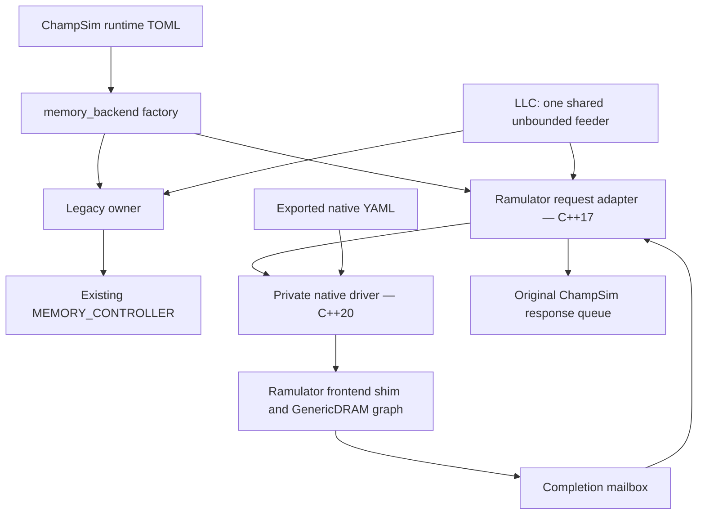

# ChampSim–Ramulator2 integration: design, evidence, and merge-readiness

Written on 2026-09-13 against ChampSim commit
`8c722681` on `feat/ramulator`. This is a retrospective and a proposed stress-test
agenda. It does not claim that the additional tests below have run.

The integration adds an optional Ramulator 2.1 DRAM timing backend while retaining
the existing ChampSim memory controller. Local tests and code review establish
legacy compatibility on selected workloads, request-transport correctness on
deterministic cases, agreement with the pinned native engine at the driver
boundary, and reproducible results on the tested Linux/GCC setup. They do not
establish arbitrary Ramulator configuration support, long-run stability,
scalability beyond two cores, or physical DRAM accuracy.

The implementation review approved the change with no unresolved Critical or
Important findings; its small replay-comparator finding was fixed in `db25b8cf`.
That review verdict and a broader mainline stress campaign answer different
questions. The campaign below is recommended to strengthen empirical confidence,
especially for workloads and configurations outside the initial test envelope.

## 1. What we integrated

### Runtime and build contract

| Choice | Behavior |
| --- | --- |
| Omit `dram-model`, or set it to `"legacy"` | Use the in-house `MEMORY_CONTROLLER` with its existing timing, queues, warmup and statistics. |
| Set `dram-model = "ramulator2"` | Use Ramulator through a ChampSim request adapter; native YAML owns DRAM geometry, timings and policies. |
| Build with `WITH_RAMULATOR2=0`, the default | No native headers, shared library or native source checkout are required. Selecting Ramulator at runtime fails with build instructions. |
| Build with `WITH_RAMULATOR2=1 RAMULATOR2_ROOT=/path` | The same executable can select either backend. The executable still depends on the native shared library even when a particular run selects legacy. |

The native source is pinned to
`72427a1bba3771564c4fb0e494ba02242fd1eaa7`, **Ramulator 2.1**. The existing external
checkout is used rather than vendoring another copy into ChampSim. The tested
setup is Linux x86-64, GCC 13.3.0 and CMake 3.28.3. Native fmt and yaml-cpp
revisions are also pinned by the build helper.

For example, [configs/ramulator2.toml](../configs/ramulator2.toml) contains:

```toml
dram-model = "ramulator2"

[ramulator2]
config = "configs/ramulator2/ddr4.yaml"
```

Paths resolve from the process working directory. Ramulator 2.1's Python
configuration definitions export fully expanded YAML; ChampSim loads that YAML
directly. Python is used for source metadata and configuration export, with no
Python interpreter or bindings in the simulation loop.

Native mode rejects every explicit `pmem.*` setting, with a diagnostic directing
the user to the YAML. Legacy mode similarly rejects `ramulator2.*` settings.
This preserves strict unused-key validation and avoids silently ignoring an old
configuration. A complete legacy TOML cannot simply be overlaid with a native
selector: remove its `pmem` table and its `sim.deadlock_cycle` key first, or start
from native `--knobs`. A legacy `--knobs` dump or statistics document records the
`sim.deadlock_cycle` its run used, 500 unless set (`configs/sample.toml` sets
1,000), and an explicit value replaces the native no-progress default described
below, so a converted DDR4 configuration can abort inside its first refresh stall.

The initial supported native shape is `External` + `GenericDRAM` +
`CacheLineInterleave`. There must be a nonempty power-of-two number of controllers,
one channel per controller, matching capacity, tCK and transaction size, and the
checked power-of-two geometry/address constraints. The adapter does not translate
every possible native frontend, memory-system architecture or heterogeneous
channel arrangement.

Within that shape, the driver admits only components that can operate behind
ChampSim's External frontend shim. It checks every controller before
constructing any native component:

| Component | Admitted `impl` | Rejected examples, and why |
| --- | --- | --- |
| Controller | `GenericDDR`, `LPDDR5`, `LPDDR6`, `GDDR7`, `HBM12`, `HBM34`, `PRAC` | `BlockHammer` casts the frontend to Ramulator's BHO3 CPU during setup. With the shim that is undefined behavior: a crash or silently inert throttling, depending on memory layout. |
| Address mapper | `RoBaRaCoCh`, `ChRaBaRoCo`, `MOP4CLXOR` | `PassThroughAddrMapper` expects the frontend to fill the address vector and faults at the first tick. |
| Row indirection | `RITAddrMapper` whose nested `addr_mapper` is one of the three above, with `reserved_rows_per_bank` absent or 0 | A nonzero reservation shifts every row up. The top of the capacity ChampSim addresses then lies outside the device, and native throws when a run reaches it. |

The controller names are all of the pinned revision's registered controllers
except `BlockHammer`. Native has no default address mapper, so omitting one is
also rejected. Configurations that reserve rows as the AQUA and Hydra plugin
sources instruct are therefore rejected too. Plugins themselves are not checked.
Admission does not certify a component's policies, only that the driver can
connect it; geometry and timing checks still apply.

Nor does admission check that a controller suits the DRAM model it drives. A
mismatched pair can be rejected by native code (an `LPDDR5` controller over DDR4
fails on an unknown command), stall until ChampSim's no-progress guard aborts
the run (an `HBM12` controller over DDR4 never completes its first request), or
run with the generic controller's semantics (`GenericDDR` over LPDDR5 or HBM3
DRAM completes). The pinned exporter's LPDDR6 organization preset has a 12-bit
`channel_width`, so every stock LPDDR6 export fails the existing byte-aligned
channel-width check; it runs only with that width edited to a multiple of 8,
which changes the modeled device.

Rejections name what was wrong. An `impl` that is not admitted, including a
misspelled or unregistered one, "is not one of the components supported behind
ChampSim's External frontend", followed by the supported list; a negative
`reserved_rows_per_bank` "is invalid; it must be absent or 0"; a component
that is present but not a table "must be a table with an impl key"; an `impl`
given as a sequence or table "must be a single name"; and a table without one
reports "impl is missing". The last three are also followed by the supported
list.

Two reproducible fixtures are included:

| Fixture | Native transaction | tCK | Exposed capacity |
| --- | ---: | ---: | ---: |
| DDR4 | 64 B | 833 ps | 8 GiB |
| LPDDR5 | 32 B | 1,453 ps | 1 GiB |

This is a timing integration. ChampSim still supplies the processor, caches,
translation, traces and upstream response metadata. We did not replace the CPU
with a Ramulator CPU frontend, add functional DRAM data storage, or establish a
new memory-consistency/value-correctness oracle.

### What compatibility means

The legacy owner returns the original controller as the scheduled operable; it
does not insert a new clock stage in front of it. Constructor defaults and argument
ordering were preserved, as were memory capacity handling and the physical-page
allocation algorithm. Old capacity constructors remain available as wrappers.

The root selector adds effective configuration metadata, so historical
configuration fingerprints change even for legacy. The compatibility claim is
exact simulation/statistic equivalence under matched settings, with documented
metadata differences, rather than byte identity of an entire old result file.

Changing native capacity can change ChampSim's physical-page allocation. Changing
native mapping or scheduling changes how memory requests are mapped or served;
it does not itself change the page allocator. Each can affect performance.
Native and legacy IPC are not expected to match. A comparison intended to isolate
DRAM timing must match the rest of the machine and account for these differences.

## 2. How the implementation works

### Architecture and source map



Only one backend and one memory operable exist in a constructed environment. The
owner exposes its operable, capacity, owned statistics and optional configuration
record. Native clock/capacity discovery does not construct a dummy legacy
controller or a second native simulator.

| Responsibility | Main source |
| --- | --- |
| Backend interface and selection | [memory_backend.h](../inc/memory_backend.h), [memory_backend.cc](../src/memory_backend.cc) |
| Preserve the original controller | [legacy_memory_backend.cc](../src/legacy_memory_backend.cc) |
| Environment wiring and page capacity | [static_environment.cc](../src/static_environment.cc), [vmem.cc](../src/vmem.cc) |
| Packet admission, fragments and callbacks | [ramulator2_memory_backend.cc](../src/ramulator2_memory_backend.cc) |
| C++17 driver contract and private native implementation | [ramulator2_driver.h](../inc/ramulator2_driver.h), [ramulator2_driver.cc](../src/ramulator2_driver.cc) |
| Optional build and ABI/library checks | [Makefile](../Makefile), [ramulator2_build.py](../config/ramulator2_build.py) |
| Phase lifecycle and timeout default | [champsim.cc](../src/champsim.cc), [main.cc](../src/main.cc) |
| Counter definitions and reporting | [memory_stats.h](../inc/memory_stats.h), [toml_printer.cc](../src/toml_printer.cc), [plain_printer.cc](../src/plain_printer.cc), [json_printer.cc](../src/json_printer.cc) |

### A request's lifetime

1. The adapter visits the feeder's RQ, PQ and WQ in that order. Within each queue,
   it submits the accepted FIFO prefix. There is no new per-core fairness policy.
2. It validates the source ID and cache-block address, copies the parent packet,
   and assigns an internal parent ID. Callback state exists before the first
   native submission. An invalid source ID, or a non-prefetch request (load,
   RFO, write or translation) whose cache block is not wholly inside native
   capacity, stops the run with an error. An out-of-range `PREFETCH` packet is
   answered or dropped locally instead, as described below.
3. A 64-byte cache block becomes two adjacent transactions for the 32-byte LPDDR5
   fixture, or one transaction for DDR4. With a native transaction larger than
   the cache block, it submits one block-sized request fitting inside that
   transaction; adjacent cache-block parents remain independent.
4. On rejection, the partially admitted parent stays at the queue head. Only the
   unaccepted suffix is retried. A head leaves the feeder only after all of its
   fragments have been accepted.
5. Native callbacks append completion events to a weakly owned mailbox. They do
   not directly erase parent state. This matters because native writes can call
   back synchronously inside `send()`, before it returns success.
6. The adapter commits acceptance bookkeeping, removes a fully admitted head,
   and then processes callbacks. A read returns exactly one response only after
   every fragment completes, using the original packet's response fields.
   Response-suppressed reads still finish bookkeeping. Writes produce no
   unsolicited upstream response.

**Out-of-range prefetches.** Physical-address caches (L1D, L2C and LLC by
default, where `virtual_prefetch` is false) forward prefetches without a range
or page-boundary check. The shipped `next_line` prefetcher requests the next
cache block and `va_ampm_lite` can request up to 256 blocks ahead; neither stops
at a page boundary. (`ip_stride` and `spp_dev` keep physical prefetches inside
the triggering page.) `VirtualMemory` allocates frames only below capacity, so
once it maps the top physical frame such a prefetch can reach the memory feeder
with a cache block at or past native capacity. Legacy `MEMORY_CONTROLLER` reads
only the address fields its geometry defines and ignores higher bits, so it
aliases the request to an in-range location and serves it with DRAM timing. The
native model has no location to alias, so the adapter never submits such a
packet. When the packet reaches the head of its feeder queue (RQ, PQ or WQ, in
FIFO order behind earlier entries), the adapter pops it and counts it in
`out_of_range_prefetches`. A read with `response_requested` gets the original
packet back immediately, exactly as fast warmup returns reads. A
response-suppressed read or a write gets no response. The handling is the same
in warmup and measured phases and counts as progress. It creates no parent,
native attempt, acceptance, completion, rejection or read-latency sample.
Out-of-range load, RFO, write and translation requests, like invalid source IDs,
still stop the run: `VirtualMemory` places every translated page and page-table
entry below capacity, so one would indicate a bug. Test 705's cases for this
policy postdate the counts recorded in section 3.

The native frontend shim forwards requests while reporting the actual compiled
core count; upstream `External` reports one core. Native controllers, schedulers,
refresh policies, address mapping within controllers and plugins remain native
components. Their behavior is not reimplemented in ChampSim.

### Clocking, phases and finalization

The driver's period comes from integer `tCK_ps` and is cross-checked against the
native public clock API. The selected memory operable participates in ChampSim's
existing global-clock scheduling. Each adapter operation processes pending
completions, admits work while safely handling synchronous completions, advances
one native memory tick, and processes the resulting completions. ChampSim owns
scheduling; native frontend clock ratios do not instantiate another CPU clock.

Fast warmup bypasses fresh native demand submissions while native maintenance
clocks continue. Phase changes clear event counters but retain native queues,
clocks, partial heads and callback contexts. A later warmup does not bypass an
already partially submitted head; that case differs from the ordinary initial
warmup and deserves additional real-native coverage.

Each finishing CPU freezes an owned shared-memory ROI snapshot. The last
finishing CPU supplies the final shared-memory snapshot, so its observation
window is not identical to every core's individual window. After all phases,
finalization runs once with no additional drain ticks. Outstanding work at
retirement is expected and must remain visible in the report.

A valid DDR4 refresh exposed a too-short inherited no-progress guard:
421 × 833 ps = 350,693 ps exceeded 500 × 250 ps = 125,000 ps. The native default
is now `max(500, ceil(10 microseconds / minimum actual operable period))`:
40,000 global ticks at 250 ps. Legacy keeps 500, and explicit positive
`sim.deadlock_cycle` settings remain authoritative. In native mode an explicit
value whose ticks cover less than 10 µs prints one stderr warning naming the value,
the stall it allows in picoseconds and this machine's native default, and saying
that legacy configurations record 500; it is not changed. Idle native ticks do not
pretend to be progress. The 10 µs allowance is a practical default, not a bound
derived from every possible native plugin/device pause.

### Statistics and reproducibility

Legacy TOML retains schema 1. Native TOML uses schema 2 with separate
`ramulator2.adapter` and `ramulator2.native` tables under each phase/scope,
plus raw native statistics YAML. Native-only output does not invent legacy
bus-utilization or congestion counters.

Adapter counters describe parent and fragment acceptance/completion, rejected
submission attempts, out-of-range prefetches, live outstanding
parents/fragments, total completed-read latency in picoseconds, and its sample
count. Parent admission and latency start at the **first accepted fragment**.
That latency excludes time waiting in the feeder before any fragment is
accepted. A rejection count measures attempts, not unique rejected requests.

`out_of_range_prefetches` (next to `rejected_submissions` in the adapter table)
is a per-phase event count of `PREFETCH` packets popped because their cache block
is not wholly inside native capacity. Warmup pops are counted too, but reports
cover measured phases only, so like every other adapter event counter a warmup
count is reset at the next phase without being reported. Those packets are
never submitted and do not appear in any other adapter counter or latency
sample. With the shipped prefetchers, a nonzero value means a physical-address
prefetcher ran past the top physical frame. The legacy controller would have
aliased those requests to in-range locations and charged them DRAM timing.

Live gauges include earlier-phase work. Consequently, a phase may complete more
requests than it accepts. Native write completion means the native callback's
command-issue/coalescing event, not that the physical bus has drained. Native
counter definitions and numeric limits are not changed by placing them beside
64-bit adapter counters.

Result metadata archives exact YAML, its normalized absolute path and content
hash, native revision, and library/build identity. Replay reads the current YAML
and checks the expected content hash/revision. It does not extract the archived
YAML automatically, restore traces or run lengths, or prove two different host
binaries are identical. The fingerprints use ChampSim's historical FNV convention;
they are reproducibility identifiers, not cryptographic attestations.

Native scalar paths retain component boundaries and escaped names. Integers are
not rounded through doubles; unsigned values above TOML's signed-64-bit range
become exact decimal strings. Native `ConfigNode` already represents scalar data
as text, so original native type/precision information lost upstream cannot be
recovered by the reporter.

### Build boundary

Public headers and the adapter remain C++17. Only the private native translation
unit uses C++20. A helper builds the pinned native shared library with Python
bindings disabled, records compiler/dependency/source identity, verifies effective
ABI settings, and invalidates objects on build-mode/compiler/root changes.
Runtime checks the identity of the loaded shared object. It asks the dynamic
loader which file it loaded for `libramulator.so`, so PIE and non-PIE executables
fingerprint the same library; CI runs a non-PIE `--knobs` check.

This is a C++ boundary, not a stable versioned C ABI. A compiler/layout probe and
pinned dependencies reduce mismatch risks; they do not certify arbitrary compiler
flags or all operating systems. Native `libramulator.so` is emitted into its source
root even with out-of-tree CMake. Builds and runs sharing that root must be
serialized; there is no cross-process build lock or atomic library publication.

Updating Ramulator is a deliberate compatibility change. The native class APIs,
source metadata, exported YAML and lifecycle/statistics contracts need to be
rechecked, the pinned revision updated, and fixtures and differential tests
regenerated or rerun. Silently patching the external checkout is not the supported
upgrade path: the build helper rejects modified tracked native source.

## 3. How we tested it

Testing used several complementary layers. The detailed counts, commands and
recovery record remain in [the validation record](ramulator2-validation.md);
portable commands are documented in [test/ramulator2](../test/ramulator2/README.md).

| Layer | Recorded evidence | Confidence and limit |
| --- | --- | --- |
| Full regression suites | Enabled: 17,414 assertions, 859 C++ cases passed, one intentional skip. Disabled: 16,988 assertions, 853 passed, seven native skips. Python, in configured trees with `bin/champsim` built: 61 passed enabled; disabled 58 passed and three native-only methods skipped (`OK (skipped=4)`, since one method skips two subtests). | Final production sources at `b5addb74`; integration commits up to `74159f1e` changed tools/docs, not production code. The review fixes after `74159f1e` change production code; see the next row. |
| Suites after the review fixes | Enabled: 17,663 assertions, 867 C++ cases passed, one intentional skip. Disabled: 17,211 assertions, 859 passed, nine native skips. Python: 73 tests, all passed enabled; disabled `OK (skipped=6)`; unconfigured checkout `OK (skipped=18)`. The oracle, integration and tool tests pass. On two short supplied windows, legacy and native DDR4/LPDDR5 output matches the `74159f1e` binaries apart from `meta.command_line` and the new, zero `out_of_range_prefetches` counter. | Local Linux/GCC 13 runs of the review fixes (five production fixes and one Python test fix) applied to `74159f1e`; not hosted CI. Details are in the validation record. |
| Suites after the second review | Enabled: 17,766 assertions, 876 C++ cases passed, one intentional skip. Disabled: 17,309 assertions, 868 passed, nine native skips. Python: 82 tests, all passed enabled; disabled `OK (skipped=6)`; unconfigured checkout `OK (skipped=27)`. The oracle, integration and tool tests pass with unchanged leaf counts. On `706.stockfish_r.sp0`, a no-progress abort with stdout redirected now leaves the full dump, ending with the memory backend's, where it left nothing. | Local Linux/GCC 13 runs of the second review's fixes (`--toml` target resolution and write modes, deadlock diagnostics that survive a throwing printer, native rejection wording, one adapter test) applied to `d3604b51`; not hosted CI. Details are in the validation record. |
| Legacy baseline comparison | Ten cold/warmed, omitted/explicit selector comparisons against `79cb5fdb` at one/two cores. All phase/prior-config leaves match: 237/177 at one core, 695/314 at two. | Exact values, including NaNs, with only documented selector/fingerprint/argv and protected-copy path differences. Limited workload coverage. |
| Deterministic adapter tests | Test 705: 195 assertions / 16 cases, including 32/64/128-byte transactions, retries, same-address parents, synchronous/out-of-order callbacks, metadata, phases and teardown. | Exercises real adapter queues against a fake driver, including deliberately awkward callback schedules. |
| Sanitizers | The same 195 assertions / 16 adapter cases pass ASan/UBSan with leak checks. | **The fake-driver adapter harness was instrumented; this is not full native-library or full-simulator sanitizer evidence.** |
| Direct native versus driver | Identical SEND/CALLBACK streams and all 44 DDR4 / 48 LPDDR5 typed native memory leaves; 22 transactions per device. | Independent callers of the same native engine; the production request adapter is absent from this oracle. |
| Real simulator integration | One/two-core DDR4, LPDDR5, two-channel DDR4 and changed-clock cases, plus supplied traces and exact typed TOML replay. | Real reads, writes, retries, source 1 traffic and live retirement boundaries. Self-replay establishes determinism, not an independent expected packet schedule. |
| Test-tool negative controls | 11 unit tests after `db25b8cf`; all eight saved original/replay pairs pass the stricter comparator. | Detect changed callback timing, duplicate acceptance, missing/wrong scalar types, integer low-bit loss, absent core traffic and input overwrites. |
| Build/deployment checks | Mode/root/ABI/dependency checks, native example construction, and forced C++17 builds of three standalone tools pass. After a test-only fix, the Python suite also passes locally in an unconfigured, unbuilt checkout using the `python` job's commands: for the 61-test suite at `74159f1e`, 55 passed and six methods that need `bin/champsim` skipped. Later counts are in the suite rows above. | Local Linux/GCC result. Hosted CI has not run; retaining its 15-entry legacy matrix is not equivalent to executing it. |

### Actual workload envelope

The supplied v2 files were SQLite (`708.sqlite_r.sp0`) and omnetpp
(`710.omnetpp_r.sp0`), with `hashed_perceptron` and `basic_btb` pinned per core.
Legacy comparisons used 100,000 warmup / 500,000 ROI instructions and cold
0 / 10,000 windows. Native supplied runs used 500,000 ROI instructions for
one-core SQLite and 100,000 per core for the two-core mixed workload. These are
windows from the traces, not full benchmark executions. The supplied native
windows had no writebacks and no outstanding work at retirement.

The generated tests filled that coverage gap. A 32,768-record, 16 MiB v2 trace
uses one 8-byte memory operand per instruction, 25% stores, and a fixed stride
across a 32 MiB address range. Small L1D/L2/LLC configurations force writebacks.
Each core runs the same generated trace, warming 2,000 and measuring at least
10,000 instructions. Generated ROI duration is approximately **0.09–0.30 ms of
simulated time**, derived from reported core cycles and configured periods.

The two-core LPDDR5 case recorded 5,131 accepted writes, 159,684 rejected
submission attempts, and 34 outstanding parents / 65 outstanding fragments at
retirement. All four two-core cases ended with live parents (39/34/49/43).
This demonstrates stopping without a drain under pending work; it is not a
long-duration resource or fairness test.

The driver oracle is smaller still: 22 source-0 rows, all 32 bytes, one channel,
seven labelled split parents, and native queue capacities of two. DDR4 takes
158 ticks (about 132 ns), LPDDR5 147 (about 214 ns). Attempts/rejections are
1,065/1,043 and 705/683; each produces 22 callbacks, including two synchronous
writes. Split-parent IDs are harness labels, not production adapter contexts.
Real 128-byte native transactions have not been demonstrated; 128-byte handling
is covered by the fake-driver adapter tests.

One changed clock configuration was tested: CPU 2,500 MHz, LLC 1,000 MHz and L2
1,500 MHz with DDR4 still at 833 ps. This changes the relevant settings independently
of the native configuration, but is not an exhaustive clock-ratio sweep.

### Problems found and corrected

The test process found and corrected an ABI-compatibility gap, lost dependency
edges in non-executing Make modes, the premature DDR4 no-progress abort, and a
replay helper that treated `1`, `1.0` and `True` as equal. Their tests and fixes
remain in the repository.

A separate validation command also exposed destructive optional-output argument
handling: `--toml=` consumed the SQLite input pathname as an output and truncated
it before input-count validation. The original 327,181,771-byte file was recovered,
verified against its exact catalog SHA-256 and compressed-stream integrity, and
restored. Subsequent empty-input crashes were excluded from native evidence.
The CLI then checked input count and filesystem output/trace aliases before
opening output. A later review found two cases that check missed: one trace path
more than the binary had cores still let `--toml` consume and overwrite a trace,
and the startup probe truncated a `--config` source, the native YAML or a results
document before a configuration error. A named output is now never written at
startup. An existing non-empty regular file that does not begin like a statistics
document is refused, and a regular target is replaced by renaming a finished
sibling over it only after a successful run. A second review found three gaps in
that first version. The checks read the name as typed while the rename used a
textual `..` fold, so `missing/../machine.toml` replaced the configuration;
every check now uses the file the kernel reaches. A rename that failed at the end
deleted the finished document, and a hard-linked output (split), a writable file
in a read-only directory and a name of 234 to 255 bytes (refused) no longer
behaved as before. Hard-linked outputs and files in such directories are now
written in place, as is a target whose rename fails, and the sibling's name has a
fixed length that fits beside any valid name. And
`--toml /dev/stdout` with stdout redirected to a log renamed over the log; the
file behind stdout or stderr now receives the document on that stream. A third
review found that the rename still gave a document a new file's group and
dropped its access ACL; a file whose owner, group or access ACL a new sibling
would not carry is now written in place. The sibling is also created with mode
0600 and given its final permission bits before any content, and writing in
place no longer asks to create a file that already exists. Writing in place,
fallbacks included, truncates first and so does not preserve an earlier document
when it fails; those errors now say the target may be empty or partial. An
existing output that may be written but not read is accepted when empty and
refused as unreadable otherwise. Tests use
named `--toml FILE -- TRACE` arguments, scratch inputs and checksum checks. See the
[recovery record](ramulator2-validation.md#validation-input-incident-and-recovery)
for the hash and original evidence.

## 4. Weak points and the stress tests they need

The following are known constraints or unproven coverage, not a claim that every
row represents a demonstrated integration bug.

| Priority / surface | Weak point | Proposed experiment and acceptance criterion |
| --- | --- | --- |
| Before merge: independent adapter/native oracle | The strongest native differential test bypasses the adapter; full simulator replay uses the same implementation twice. | Feed the production adapter through the real driver, log native attempts/callbacks with a test-only decorator, and independently predict fragmentation and upstream parent responses. Start with 10 deterministic seeds × 10,000 parents, tiny buffers, source 0/1, repeated addresses, suppressed reads and phase boundaries. Require exact accepted streams, one correct response per requested read, no duplicate accepted fragment, and response only after the last fragment. |
| Before merge: native sanitizer coverage | Native allocation, controller/plugin lifetimes and the real callback path were outside the instrumented fake-driver harness. | Build compatible host **and native library** with ASan/UBSan and leak checks; run the native-backed oracle, generated simulations, repeated construction/destruction and termination with live requests. Require no sanitizer reports and unchanged deterministic results. The current helper strips inherited native compiler flags and builds in Release mode, so host sanitizer flags alone are insufficient: add a supported instrumented native build path with matching provenance. |
| Before merge: sustained overload and recovery | The shared feeder is intentionally unbounded; rejection retains work rather than providing a new finite LLC backpressure boundary. Pending parents/forwarded native requests and snapshots consume memory and allocation time. | Progress from 1M to 100M ROI instructions on selected read/write/prefetch-heavy workloads, plus repeated producer-pause recovery in a request harness. Sample feeder/parent/native/response depths, RSS and simulation throughput. Require exact completion accounting and recovery of live objects after input stops; distinguish overload backlog and allocator retention from leaks. Do not require constant RSS under unlimited offered load. |
| Before merge: interference and larger machines | Only 1/2 cores and 1/2 homogeneous channels were exercised. RQ/PQ/WQ order adds no fairness quotas, and global progress can hide one request or core starving. | Use 4/8-core builds and 1/2/4 channels with asymmetric row-hit versus row-conflict traffic, read/write mixtures, prefetch floods, hot channels and staggered completion. Require all finite workloads to finish under declared bounds; inspect per-core progress, maximum age and tail latency. Compare native submission traces before attributing native-policy effects to the adapter. |
| Before merge: clocks and epochs | One frequency combination and selected phase transitions do not cover all quantization, refresh or pending-callback boundaries. The 10 µs timeout is heuristic. | Sweep core, cache and native periods, including non-dividing periods and long idle/maintenance intervals; test zero/short ROIs and real partial heads across phase changes. Require tick/response visibility agreement with an independent scheduling reference, unchanged explicit guards, preserved latency origins, immutable snapshots and no finalization ticks. A valid pause longer than the default must pass with a suitable explicit override. |
| Before merge: native counter limits | In pinned native `memory_system/impl/generic_dram_system.cpp`, top-level accepted-read and accepted-write counters are signed `int`. On the tested host, incrementing either beyond 2,147,483,647 between resets overflows signed arithmetic. Adapter `uint64_t` counters do not prevent this. | Exercise a targeted near-limit native counter fixture under UBSan and define the supported maximum phase request count. Promote/check affected upstream counters, or enforce and document a supported bound before claiming arbitrarily long phases. Count native fragments, not cache-block parents; inspect plugin/controller counters separately rather than assuming identical types. |
| Before merge: hosted/clean-host checks | Local dependencies were reused; the hosted matrix has not executed. C++ ABI probing is useful but not an exhaustive portability guarantee. | Run hosted native/legacy jobs on the intended merge revision and reproduce from a clean supported host. Test mode/root/compiler changes, interrupted builds, missing/substituted libraries and loader paths. Require correct rebuilds, useful rejection of incompatibilities and no native dependency in disabled builds. Keep shared-root concurrent builds unsupported unless locking/publication is implemented. |
| Before broader device support: native YAML and plugins | Common geometry/table validation is not a complete semantic validator for every native component. Only two presets were exercised, with clock-ratio fields set to one. | Test each intended DRAM/controller/refresh/mapper/plugin combination, actual 128-byte transactions, boundary addresses, capacities and interleave shifts. Fuzz malformed tables and component parameters in subprocesses with time/RSS limits. Valid supported cases must progress and match native references; invalid cases must fail clearly rather than crash or hang. Explicitly settle non-default clock-ratio semantics before advertising them. |
| Before broader plugin support: epochs and file outputs | Native plugins own their reset/update/finalize behavior. Some open files during construction or finalization; ChampSim's TOML-versus-trace checks do not sandbox those paths. | Exercise counter, trace-recording and stateful plugins through multiple phases, pending finalization and output errors, using dedicated scratch paths. Verify each plugin's epoch/state contract and closed/error-checked outputs; test intended output paths independently of the CLI protection. |
| Before performance conclusions: model fidelity and host overhead | Native agreement proves that the wrapper uses the same engine consistently; it does not validate that engine/preset against hardware. No systematic simulator overhead study was performed. | Match capacities, mappings and controller settings, validate native command traces against an independent supported reference, and compare latency/bandwidth trends with a declared calibration method. Separately profile adapter allocation, queue walks and snapshot costs. Define tolerances and a practical resource budget before interpreting results. |
| Before durable sign-off: evidence retention | Most raw baseline outputs, binaries, logs and exact command/provenance records remain under `/tmp`; some baseline helpers are not committed. | Preserve a versioned evidence bundle and verify the public deterministic subset from a clean checkout. Require manifests with revisions, commands, dependency/compiler/Python identities, input hashes, expected results and checksums; keep restricted trace inputs separate. |

The native signed-counter limit is an upstream code-level bound identified while
preparing this report; no overflow was observed in the completed runs, which are
far below it. The broader configuration/plugin issues are coverage and contract
limits, not evidence that a particular untested plugin already fails.

Checked capacity arithmetic also does not impose a practical host-memory budget:
large valid capacities can require substantial physical-page bookkeeping in
`VirtualMemory`. Capacity-boundary tests should check allocation behavior as well
as native address arithmetic.

### Invariants to use during stress testing

Capture live state at both sides of a phase boundary. For matching observation
windows, request accounting should satisfy:

```text
parents_end = parents_begin
            + accepted_reads + accepted_writes
            - completed_reads - completed_writes

fragments_end = fragments_begin
              + accepted_fragments - completed_fragments
```

Here “parents” means admitted parents, including partially admitted ones.
Completely unaccepted feeder heads and out-of-range prefetches are outside these
gauges and need separate queue accounting. A partially admitted parent can
remain outstanding with zero currently outstanding fragments.

Also require one native completion per accepted fragment, one upstream response
per completed response-requested read (plus one immediate response per
response-requested out-of-range prefetch read), original response metadata, no
write or suppressed-read response, and no accepted fragment retried. In a controlled
recovery harness, continue clocks after stopping the producer and consume responses
to check eventual cleanup. Do not add that diagnostic drain to normal measured
simulation retirement.

For multicore tests, report per-core age/progress as well as aggregate throughput.
A global no-progress detector cannot establish fairness. For latency studies,
measure pre-admission feeder delay separately from the existing accepted-read
latency statistic.

## 5. Proposed path to mainline

Use a staged campaign rather than the full Cartesian product of every setting:

1. Run the hosted jobs and a clean supported-host reproduction at the proposed
   merge revision. Freeze the exact production/native/toolchain identities.
2. Add the real-native adapter differential and full-stack sanitizer checks.
   These close the most important gaps between the existing test layers.
3. Run overload/recovery, longer mixed workloads and 4/8-core interference cases.
   Start short to catch accounting errors, then extend selected cases to soak
   durations while tracking memory and request age.
4. Cover clock/phase boundaries and resolve the native signed-counter bound.
   Keep support claims restricted to configurations whose contracts were checked.
5. Archive results and record each outcome as passed, failed, or explicitly
   unsupported with a reason. Do not convert a missing run into a passing result.

Broader devices/plugins and hardware calibration can be separate follow-ups if
mainline scope is explicitly limited to the initially validated configurations.
No accuracy percentage or throughput target can be justified from the current
integration tests alone.

## 6. What must survive for posterity

The design, implementation plan, final review, fixture exports, native oracle
stream, generators and portable test tools are committed. This report records
the tested envelope and the follow-up agenda. Raw evidence under
`/tmp/champsim-ramulator-validation` is useful locally but is not durable storage.

A permanent evidence bundle should retain the baseline revision
`79cb5fdb2abd7e754b529eb235c6a69f61e45ea8`; tested production revision `b5addb74`;
native/dependency/compiler identities; exact argv and effective configuration;
trace and binary/library hashes; one-/two-core compile settings; baseline and
replay TOMLs; native attempt/callback/raw/typed outputs; full test/sanitizer
commands and logs; negative controls; and the input recovery record. Generated
traces can be regenerated from a versioned recipe and checked by SHA-256.
Restricted benchmark traces need their identities and an access procedure rather
than automatic redistribution.

Existing records:

- [Approved design](superpowers/specs/2026-09-13-ramulator2-design.md)
- [Completed implementation plan](superpowers/plans/2026-09-13-ramulator2.md)
- [Detailed validation, reproduction commands and recovery record](ramulator2-validation.md)
- [Final review and scalar-type correction](superpowers/reviews/2026-09-13-ramulator2.md)
- [Portable regression tools and their limits](../test/ramulator2/README.md)

No new simulation, sanitizer or hosted CI campaign was run to write this report.
The additional stress tests are proposed work, not newly completed evidence.
