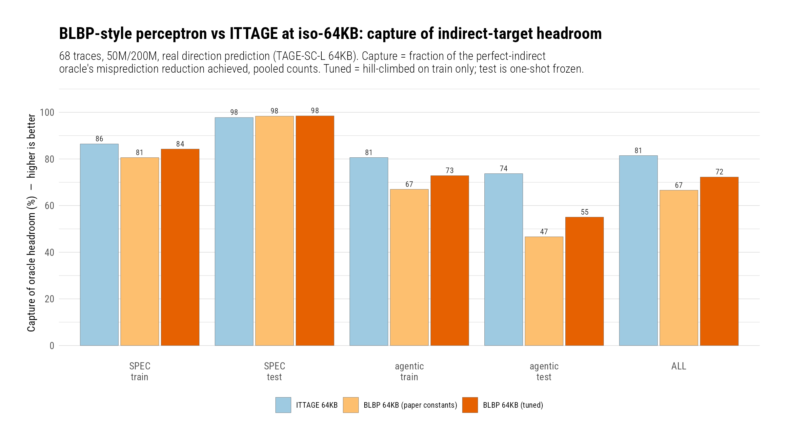
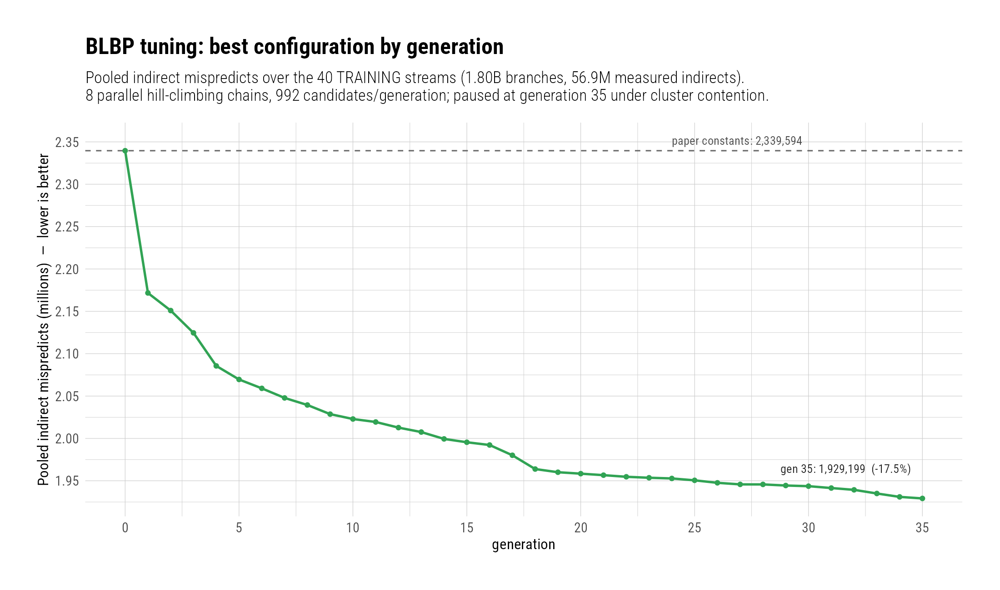

# A Tuned BLBP-Style Perceptron Does Not Catch ITTAGE At Iso-Budget On Our Workloads — And The Deficit Is Structural, Not A Bug

**Date:** 2026-08-13 · **Branch:** `rbdev` · **Authors:** Rahul Bera and Claude Opus 5

---

## 1. Key Idea

ITTAGE (previous campaign) captures ~82% of the indirect-target headroom on our
trace zoo. BLBP — Garza et al.'s bit-level perceptron indirect predictor, ISCA
2019 [1] — claims a 5% misprediction edge over ITTAGE at equal budget on CBP-5
traces, via a fundamentally different mechanism: perceptrons predict the low 12
bits of the target individually, and a 64-way IBTB supplies candidates scored by
bit-similarity. If the claim transferred, BLBP would be the better foundation
for the agentic-workload indirect problem.

**It does not transfer.** A clean-room BLBP (no reference implementation was
ever published), tuned on our own traces with a 1,400-core campaign that cut its
training objective 17.5%, still captures **72.3% of oracle headroom vs ITTAGE's
81.5%** at iso-~64KB, with the deficit concentrated exactly where it matters —
**55.1% vs 73.7% on held-out agentic workloads**. An adversarial audit attributes
the gap to BLBP's structure, not our implementation: on megamorphic branches the
correct target is almost always *in* the candidate set (delivery ≥99.2% of the
oracle-selection ceiling) but **89% of gap mispredicts are selection failures**
— the 12-bit similarity race picks the wrong candidate — and the two constants
that would fix it (K, M) are size-bearing, so an iso-budget tuner cannot touch
them.

## 2. Mechanism

Clean-room implementation of [1]: `inc/blbp/blbp.h` (engine + full predictor,
runtime-configured), `inc/blbp/blbp_btb.h` (adapter, `ittage_btb.h` pattern),
shells `btb/blbp_64kb` (paper constants) and `btb/blbp_64kb_tuned`. All ITTAGE-
audit defect classes designed out from day one (always_taken on the whole
indirect path; self-contained update; single-core guard); the invariance gate
passes on all 68 traces (worst spread 0.00021%, the documented fetch/retire
boundary skew on the usual traces).

Since no reference exists, correctness rests on: the paper's own worked
examples as golden tests (Figure 3's weight trace 3333→2424→1515→0606 including
the tie-to-later-candidate detail that contradicts the printed pseudocode;
Figure 4's similarity arithmetic, where the printed "43" is a typo for 41); the
perfect_indirect oracle bound; and the adversarial audit's independent probes.
Choices the paper leaves open (M=952 derived from budget, folded-XOR GHIST
hash, Figure-5 transfer values, SRRIP details, θ-adaptation period 32) are
documented at their sites; the untuned config is a *nearest-reproduction
proxy*, not a reproduction.

**Storage, strictly counted (post-audit):** 4096-entry IBTB at 38 bits/entry
(8 tag + 7 region + 20 offset + 2 SRRIP + 1 valid) + region table + histories
+ θ + 8×952×12 4-bit weights = **64.48 KB**. An earlier figure of 63.98 KB
omitted the valid bit; a strict-64KB variant would use M=941. The comparison is
"iso-~64KB", and the ~0.5 KB skew *favors* BLBP — which still trails — so it
cannot have manufactured the conclusion. ITTAGE-64KB: 64.0 KB (48-bit target
accounting, previous campaign).

### Files/Commits

`d878f954`…`631a243a` on `rbdev`: core+adapter+shells+tests (168/169), tuning
tools (`tools/blbp_tune/`: extractor, `blbp_eval`, cluster+local tuners,
`TUNING_NOTES.md`), cluster configs, audit fixes. Suite: 727 cases green.

## 3. Evaluation Methodology

- **Machine/window:** as all prior campaigns — stock core, real direction
  prediction (`cbp6_tagescl64`) in every configuration, 50M warmup / 200M
  simulated, all runs on the kratos2 cluster.
- **Traces:** the 68-trace zoo — 32 SPEC specrate-int + 36 agentic (9
  SWE-agent families × 4 windows).
- **Train/test split by family** (no window leakage): 40 train (rubocop, redis,
  prometheus ± toolchain; SPEC stockfish/sqlite/omnetpp/gcc/llvm/vpr/zstd), 28
  test (immutable-js, gin-gonic, ripgrep; SPEC ntest/cpython/cppcheck/abc/gem5/
  sealcrypto/ns3). **Test traces were never extracted into tuning streams — the
  firewall is physical**, verified by the audit.
- **Tuning:** stream-driven parallel hill-climb (8 chains, 992
  candidates/generation, one Slurm array each) over intervals/transfer/θ only —
  every size-bearing parameter frozen. Paused at generation 35 under queue
  contention: 2,339,594 → 1,929,199 pooled train mispredicts (−17.5%). A local
  26-worker polish arm added only 0.2% then stalled — the frozen config is a
  genuine local optimum of this space. Config **committed before any test-set
  number existed**; the test set was evaluated exactly once.
- **Proxy honesty:** stream objective −17.5% vs full-run train −11.9% looks like
  slippage but is dilution: 33.5% of full-run mispredicts sit on the BTB-gated
  floor the tuner cannot see. Floor-adjusted, the full-run reduction is 17.9%;
  the absolute mispredict delta transferred at 97.2%.
- **Metrics:** capture = pooled fraction of `perfect_indirect`'s misprediction
  reduction achieved. Speedups are **pooled-cycles ratios** (geomean agrees to
  the third decimal, same ordering).

## 4. Key Results

*(figure: `figs/blbp_vs_ittage.{png,pdf}`, numbers in
`figs/blbp_vs_ittage_numbers.csv`; per-trace data in
`figs/per_trace_5config.csv`)*

| capture of oracle headroom | all | spec/train | spec/test | agentic/train | agentic/test |
|---|---|---|---|---|---|
| ITTAGE 64KB | **81.5%** | 86.4% | 97.8% | 80.6% | **73.7%** |
| BLBP (paper constants) | 66.6% | 80.6% | 98.3% | 67.0% | 46.6% |
| BLBP (tuned) | 72.3% | 84.3% | 98.5% | 72.8% | **55.1%** |

Speedup over basic_btb, pooled-cycles, all 68: ITTAGE 1.0174×, BLBP-tuned
1.0146×, BLBP-untuned 1.0133×, oracle 1.0227×.

1. **ITTAGE remains the stronger indirect predictor at iso-~64KB on this zoo,
   and the paper's +5% does not transfer.** The gap is 9.2 capture-points pooled
   and 18.6 on held-out agentic. Not an implementation artifact: BLBP beats
   ITTAGE outright on 8 of 68 traces, non-indirect classes are bit-identical
   across all configs, and the deficit reproduces in gating-free stream evals.
2. **The deficit is structural: selection, not delivery.** On probed gap traces
   the correct target is in the candidate set ≥99.2% of the time (relative to
   the oracle-selection ceiling), but the wrong-candidate rate rises
   monotonically with candidate-set size — ~0% at 1 candidate, 20–22% at 33–63.
   BLBP behaves as published on small (CBP-5-like) target sets and degrades on
   our megamorphic ones.
3. **The two constants that would fix it are locked by the budget.** K=12 binds
   on redis (32.1% of one window's misses have chosen and correct targets
   identical in the low 12 bits — indistinguishable *by construction*; a K=16
   diagnostic removes 38.6% of misses). M binds on rubocop (M=4096, +37 KB,
   removes 64.4% of misses on the top gap contributor, only 3.9% on redis).
   Iso-budget cannot buy both. ITTAGE's layout — full targets in tagged
   entries, selection by history match — sidesteps the whole failure class.
   (Diagnostic percentages are stream-derived; stream deltas transfer to full
   runs at ~0.68×, so they are optimistic bounds.)
4. **Tuning worked and generalized where headroom existed.** Held-out agentic
   gains exceeded train gains (+8.4 vs +5.9 capture pp) — the opposite of
   overfitting; held-out SPEC was already at 98.3% untuned (ceiling-limited,
   ~26K above-floor misses). The tuner compressed every history interval toward
   recent history (all 8 chains independently collapsed one interval to a
   single bit at depth ~159) — our dispatch loops correlate on far shorter
   conditional history than CBP-5's workloads.
   
5. **Disclosures.** (i) The pooled objective sacrificed two families: sqlite
   (train) +7,524 mispredicts (capture 96.6→91.3) and gem5 (test) +582 — a v2
   objective should carry a per-family guard. (ii) Six `*_w00000` traces are
   behaviorally the same agent-startup window and carry 43% of the pooled
   agentic excess; the top-3 traces carry another 42% — the gap is
   concentrated, not uniform. (iii) On ripgrep_w00003, tuned BLBP (1.959
   indirect MPKI) is *worse than basic_btb* (1.947) — the sole such inversion.
   (iv) The agentic-test deficit is real predictor deficit, not floor: the
   BTB-gated floor is 11.5% of untuned mispredicts there vs 62.6% on spec/test.
   (v) Reproduction-fidelity caveats: our singleton-set training reading is
   conservative (a literal paper reading scores ~2% better); a possible one-bit
   interval-endpoint offset affects the untuned config only; θ-period and M are
   underived in the paper.

## 5. Next Steps

1. **Take ITTAGE as the indirect-predictor foundation** for this line of work;
   BLBP-style bit-level prediction is not competitive at iso-budget on
   megamorphic agentic workloads.
2. **If BLBP is pursued further, attack K and M, not the intervals** — an
   over-budget K=16/M-doubled configuration is the honest next data point, and
   region-compression savings could fund part of it.
3. **Understand the single-bit interval at depth ~159** that every chain found
   — likely one specific dispatch-loop branch; identifying it may reveal a
   cheap feature.
4. **Per-family guard in any future tuning objective** (the sqlite regression).
5. **The six-fold startup window** suggests deduplicating agentic warmup
   windows in the zoo, or weighting them as one.

## References

[1] E. Garza, S. Mirbagher-Ajorpaz, T. A. Khan, D. A. Jiménez. "Bit-Level
Perceptron Prediction for Indirect Branches." ISCA 2019.
<https://www.elbagarza.com/pdfs/blbp_isca2019.pdf> — no artifact was ever
released (verified 2026-08-13).

[2] A. Seznec. "A 64-Kbytes ITTAGE indirect branch predictor." JWAC-2/CBP-3,
2011. The comparison baseline, from the previous campaign
(`docs/research-log/CBP6/`, commits `d878f954`, `77292b74`).
