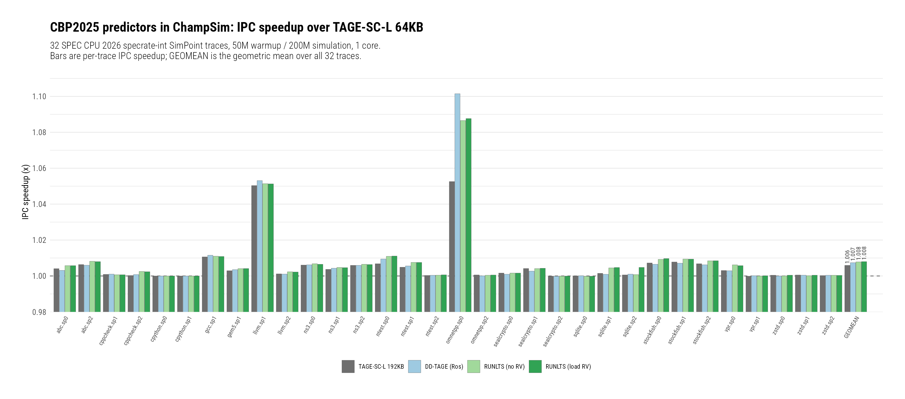
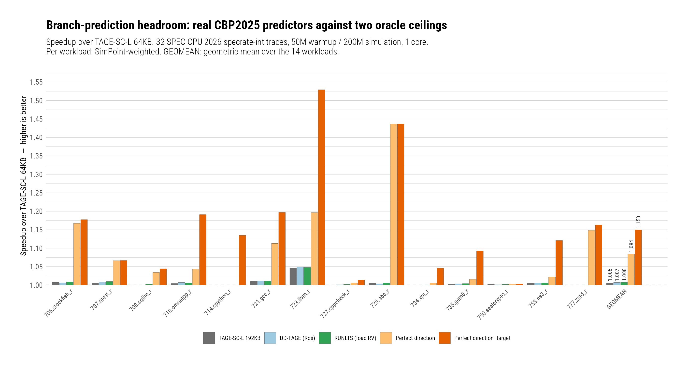
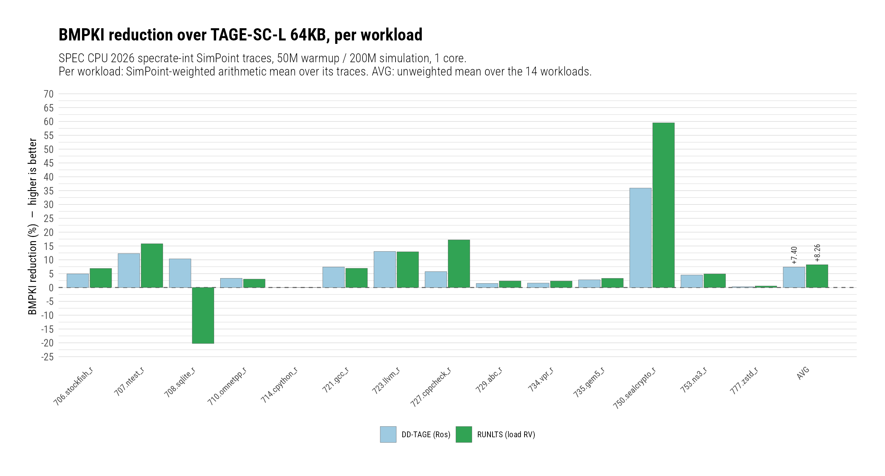
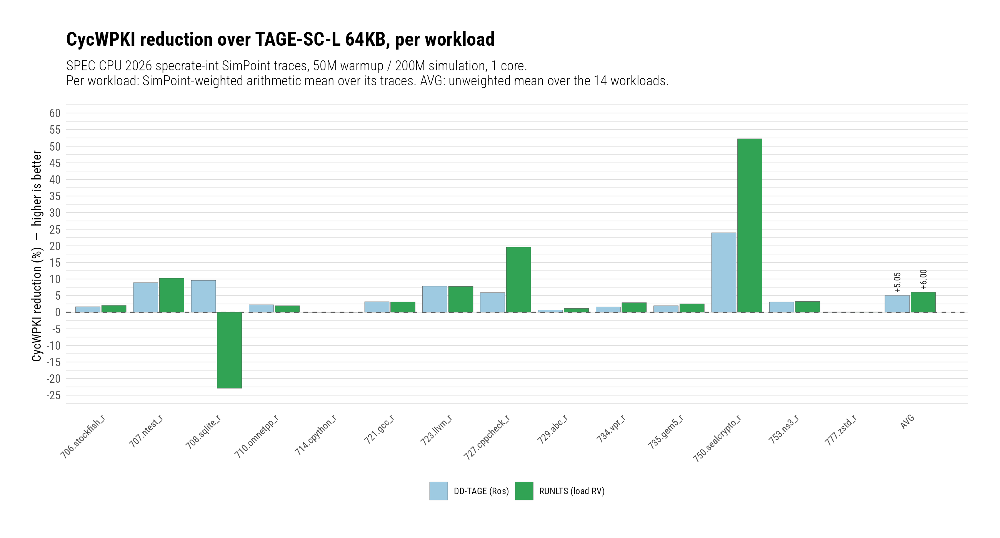
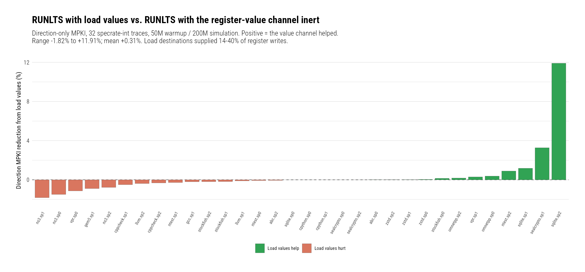
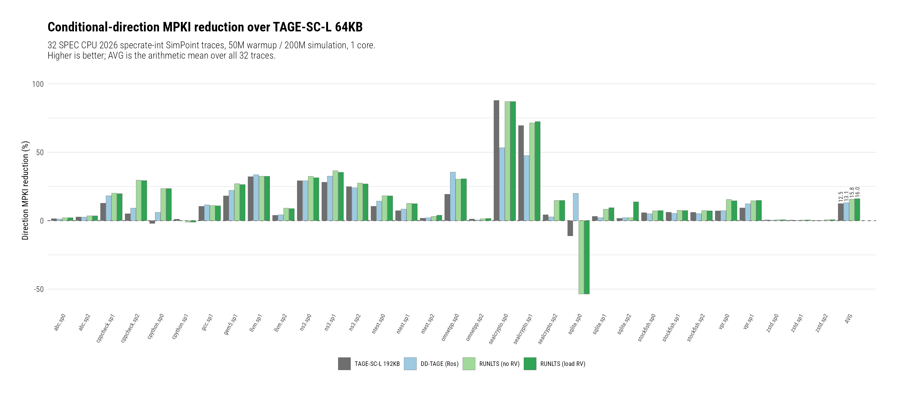

# Hosting The CBP2025 Championship Branch Predictors In ChampSim: RUNLTS, DD-TAGE And TAGE-SC-L On SPEC CPU 2026

**Date:** 2026-08-06 · **Branch:** `rbdev` · **Authors:** Rahul Bera and Claude Opus 5

---

## 1. Key Idea

The 6th Championship Branch Prediction (CBP2025) [1] ranked nine branch
predictors against each other, but it did so inside its own trace-driven
simulator, on its own traces, with its own core model. None of those three
things is ours. A CBP2025 result therefore says which predictor won *that*
competition; it does not say what any of those predictors would be worth inside
our ChampSim ecosystem — our SPEC CPU 2026 SimPoint traces, our core width, our
cache hierarchy, our prefetchers. The only way to find out is to run them here.

The obstacle is that the two simulators expose branch prediction through
incompatible interfaces. CBP2025 drives a predictor through nine pipeline-event
callbacks (`beginCondDirPredictor`, `notify_instr_fetch`,
`get_cond_dir_prediction`, `spec_update`, `notify_instr_decode`,
`notify_agen_complete`, `notify_instr_execute_resolve`, `notify_instr_commit`,
`endCondDirPredictor`), several of which carry state ChampSim has no notion of.
ChampSim drives a predictor through a small SFINAE-detected module interface
bound to `O3_CPU`. Porting each predictor by hand would mean rewriting
submissions we do not own and cannot then claim to have evaluated faithfully.

The approach taken instead is an **adapter**: a single host layer that presents
the CBP2025 tenant interface on top of ChampSim's module hooks, so that a
championship submission is *vendored unmodified* and driven, rather than
rewritten. Four predictors now run under it — the CBP2016 64KB TAGE-SC-L that
CBP2025 hands contestants as a starting point, a 192KB-scaled TAGE-SC-L, the
championship winner RUNLTS, and Alberto Ros's DD-TAGE — and this report records
what they are worth on 32 SPEC CPU 2026 `specrate-int` SimPoint traces, together
with a measurement of the one thing the port cannot carry across faithfully:
RUNLTS's register-value channel.

## 2. Mechanism

The adapter is a header-only host, `champsim::cbp6::host<Tenant>`, that owns one
CBP2025 predictor instance and translates between the two interfaces. Each
ChampSim branch module is then a thin shell: it forwards ChampSim's hooks to a
function-local-static host and does nothing else. Vendored submissions are
compiled inside an anonymous namespace so that several of them — which share
class names, global table names and include guards — can be linked into one
binary, as ChampSim's `config.sh` compiles every module it finds by default.

### 2.1 Data Structures

- **`champsim::cbp6::host<Tenant>`** (`inc/cbp6/cbp6_host.h`) — the translation
  layer. `{seq_no_, last_prediction_, checker_, log_, in_flight_, pending_reg_,
  registers_marked_, values_delivered_, delayed_}`. `seq_no_` synthesises the
  monotonically increasing sequence number CBP2025 predictors expect, which
  ChampSim does not supply. `last_prediction_` retains the prediction between
  ChampSim's `predict_branch` and `last_branch_result` hooks, because the CBP6
  update path needs both the prediction and the outcome and ChampSim delivers
  them at different times. **The host must have static storage duration**: the
  vendored predictors' constructors do not initialise every member and rely on
  the zero-initialisation only static storage provides.
- **`champsim::cbp6::protocol_checker`** (`inc/cbp6/cbp6_protocol.h`) — an
  opt-in call-sequence validator (`CBP6_PROTOCOL_CHECK=1`) holding
  `outstanding_`, a map of in-flight predictions. It asserts the invariants the
  CBP6 framework guarantees but ChampSim does not naturally enforce: one
  prediction per conditional branch, updates only for predicted branches, and
  `pred_dir == resolve_dir == true` on the non-conditional path.
- **`champsim::cbp6::cbp6_register(unsigned char)`**
  (`inc/cbp6/cbp6_register_map.h`) — maps ChampSim's register numbers (Pin's x86
  `REG` enum truncated to a byte) onto the 65-entry AArch64-shaped register file
  CBP2025 predictors index: GPRs 3–18 → 0–15, flags (25) → 64, SIMD 155–189 →
  32–51, instruction pointer and unknown numbers → dropped. The banding matters
  because RUNLTS's `make_reg_digest()` hashes slot <32 as an integer, 32–63 as a
  float and 64 as flag bits; a mis-banded register yields a feature that looks
  valid and means nothing.
- **`champsim::cbp6::ddtage_tenant<Base>`** (`inc/cbp6/cbp6_ddtage_tenant.h`) —
  presents Ros's submission through the interface the host calls. Templated on
  its base purely so the argument mapping can be tested against a recording base.

### 2.2 Host Algorithm, Keyed To ChampSim Hooks

1. **`initialize_branch_predictor`** → `tenant.setup()`, after asserting single
   core (all tenants keep state in namespace-scope globals).
2. **`predict_branch(ip, …, branch_type)`** → for a direction-predicted branch,
   `tenant.predict(seq_no_, 0, ip)`; the result is retained in
   `last_prediction_`. Non-direction-predicted branches never reach the tenant's
   prediction path.
3. **`last_branch_result(ip, target, taken, branch_type)`** → the resolved-outcome
   path. Computes the architectural **next PC**, then calls
   `tenant.history_update(...)` for every branch and, for conditionals,
   `tenant.update(...)`; for non-conditionals, `tenant.TrackOtherInst(...)`.
4. **`branch_execute_resolve(instr_id, …)`** → optional delayed-update mode
   (`CBP6_DELAYED_UPDATE=1`), which retires the update at execute rather than at
   fetch, matching CBP6's timing more closely.
5. **`branch_decode_notify` / `branch_execute_notify`** → the register-value
   channel (section 2.3).
6. **`branch_predictor_final_stats`** → `tenant.terminate()` plus the
   direction-only MPKI report, computed over ROI instructions so it matches the
   window ChampSim reports its own statistics over.

The **next PC** deserves its own note. ChampSim's `branch_target` is the
successor's IP for a taken branch but zero for a not-taken one. TAGE-SC-L tests
`nextPC < PC` to detect backward branches *unconditionally*, not gated on taken,
so passing zero makes every not-taken conditional look like a loop. The host
instead reads the successor from `input_queue`, which is correct in both cases
and is safe because it happens only on the resolved-outcome path. Measured
impact is small (1.862 vs 1.863 MPKI on 400.perlbench, i.e. noise), consistent
with the vendored header's own annotation that IMLI is worth ~0.2%; it is kept
because it is semantically correct and free, not because it moves the number.

### 2.3 The Register-Value Channel

RUNLTS's distinguishing contribution is a statistical corrector indexed by a
digest of recently produced architectural **register values**, delivered through
`notify_instr_decode` / `notify_instr_execute_resolve`. ChampSim traces carry
register *indices* but no register *values*, so on a stock trace this component
is structurally inert: `RegFileState` entries never become valid,
`register_values` stays −1, the guard in `predict()` never selects a register,
and `RBias` contributes nothing.

Our v2 trace format does, however, carry the data value of every memory operand.
That permits a partial channel: the destination register of a **load** can be
given its true value, while every other register write reports "no value". The
host therefore records the architectural destination register at decode
(`pending_reg_`) and, at execute completion, delivers the loaded value if the
instruction was a load with a payload. Roughly a third of register writes are
covered. Whether a third of the channel buys any of the component's benefit is
an empirical question, answered in section 4.

### 2.4 Vendoring Deviations

Faithfulness is the point of the adapter, so every change to a vendored
submission is enumerated here and documented at its site in the source:

1. Vendored headers renamed `.h` → `.hpp`, with internal includes rewritten.
   ChampSim force-includes a module's `.h` files into the generated instantiation
   translation unit, which would pull the predictor in twice.
2. RUNLTS's internal `#include "my_cond_branch_predictor.h"` →
   `"runlts_interface.hpp"`.
3. `PRINTSIZE` disabled in the 192KB TAGE-SC-L and in DD-TAGE. Their constructors
   write a storage table to stdout, which every binary would emit at static-init
   and which corrupts `--json` output. Budgets were checked once out-of-tree
   instead; DD-TAGE self-reports **191.900269 KB**, matching the 191.90 KB in the
   submission.
4. The submissions' unused global predictor instances (`static CBP2016_TAGE_SC_L
   tage_sc_l;` and equivalents) commented out — they exist to be named by the
   CBP6 interface file, which ChampSim does not use, and each would construct a
   second full ~192KB predictor per binary.
5. Three uninitialised RUNLTS members given explicit initialisers (`fphist = 0`,
   `C_hist = {}`, and `int NewlyDecay = 0` — in `int NewlyDecay, NewlyUseful = 4;`
   only the last declarator was initialised). All three are read before first
   write; the third was found by a heap-poisoning harness.
6. DD-TAGE's `LoopPredictor::CONF_MAX` changed from `static const` to `static
   constexpr`. It is passed to `std::min`, which takes its arguments **by
   reference** and so odr-uses it, and the submission provides no out-of-class
   definition. This links at `-O3`, where `std::min` is inlined and the reference
   never materialises, and fails to link at lower optimisation levels — so the
   simulator binaries built cleanly and only ChampSim's test binary caught it.
   `constexpr` is implicitly inline in C++17, supplying the definition without
   adding one; same type, same value. Verified behaviour-neutral by rebuilding
   and reproducing `723.llvm_r.sp1` bit-identically (4549491 cycles, 8.591 MPKI,
   650.7 CycWPKI), so the sweep results are unaffected.

One known defect in the RUNLTS submission was deliberately **not** patched:
`CBP2025_RUNLTS::TrackOtherInst` forwards `pred_dir` and `resolve_dir` in swapped
order. It is inert in both the CBP6 framework and this adapter because that path
only ever carries unconditional branches, where both are true. Rather than modify
the submission, the protocol checker asserts that precondition.

DD-TAGE required one further mapping, because its method names and one argument
order differ from what the host calls: `historyUpdate(pc, brtype, taken, pred,
next_pc)` takes the resolved direction where the host passes the prediction, i.e.
**swapped**. Passing them straight through would train the predictor on its own
prediction instead of the true outcome — degrading accuracy without ever
asserting — so the mapping lives in a tested header rather than inline.

### 2.5 Files Touched

- `inc/cbp6/cbp6_host.h` — the CBP2025↔ChampSim translation layer.
- `inc/cbp6/cbp6_types.h` — branch-type constants and CBP6 `brtype` encoding.
- `inc/cbp6/cbp6_protocol.h` — opt-in protocol checker and call-log writer.
- `inc/cbp6/cbp6_call_record.h` — dependency-free 40-byte call record.
- `inc/cbp6/cbp6_register_map.h` — ChampSim → CBP2025 register-file mapping.
- `inc/cbp6/cbp6_ddtage_tenant.h` — DD-TAGE method/argument-order adapter.
- `branch/cbp6_tagescl64/`, `branch/cbp6_tagescl192/`, `branch/cbp6_runlts_norv/`,
  `branch/cbp6_ddtage/` — the four tenant modules, each with its vendored source.
- `inc/modules.h`, `inc/ooo_cpu.h`, `src/ooo_cpu.cc` — four new branch-predictor
  hooks (`branch_predictor_final_stats`, `branch_execute_resolve`,
  `branch_decode_notify`, `branch_execute_notify`) and wrong-path accounting.
- `inc/trace_instruction.h`, `inc/instruction.h`, `src/tracereader.cc` — the v2
  (512-byte) trace record, its memory-value payload, and explicit branch types.
- `inc/inf_stream.h`, `Makefile`, `vcpkg.json` — zstd streaming decompression.
- `inc/core_stats.h`, `src/core_stats.cc`, `src/plain_printer.cc`,
  `src/json_printer.cc` — `cycles_on_wrong_path` and the CycWPKI statistic.
- `inc/listeners/heartbeat.h`, `src/main.cc` — configurable, flushed heartbeat
  and the `--trace-version` / `--heartbeat-frequency` options.
- `branch/perfect_branch/`, `btb/perfect_btb/` — the two headroom oracles.
- `tools/cbp6_replay/` — standalone differential-replay oracle.
- `test/cpp/src/{086,087,088,089,090,176,177,178,179,180,181,182,183}-*.cc` — the
  tests for all of the above.

### 2.6 Commits Covered

| Hash | Label |
|---|---|
| `16fa718c` | design doc |
| `fd997fb1` | v2 trace record |
| `90419594` | zstd decompression |
| `41657994` | v2 + .zst end to end |
| `ffd11ead` | v2 payload in `ooo_model_instr` |
| `560c32b7` | host TAGE-SC-L (Milestone 1) |
| `7ee46e57` | next\_pc impact measured |
| `f1615374` | protocol checker + replay (Milestone 2) |
| `6eac3175` | TAGE-SC-L 192KB + RUNLTS (Milestone 3) |
| `a80402ac` | third uninitialised member, latent swap pinned |
| `3cac0c5c` | final-stats hook, direction-only MPKI |
| `7457852a` | execute-time update hook |
| `f602b806` | audit fixes |
| `ce6d9dae` | explicit-branch-type contract |
| `c9029f78` | v3 tracer handoff |
| `558fc716` | configurable, flushed heartbeat |
| `bca7cd83` | CycWPKI statistic |
| `68d71de7` | register-value channel from load values |
| `f29c18b3` | DD-TAGE (Ros) |

## 3. Evaluation Methodology

- **Simulator.** ChampSim at `51588e1d` plus this branch. Single core, 6-wide
  fetch/decode/dispatch, 352-entry ROB, 128/72 LQ/SQ, 128-entry scheduler,
  `mispredict_penalty` 1; 32KB L1I / 48KB L1D / 512KB L2 / 2MB LLC, no
  prefetchers, LRU; DDR-3200, one channel. This is the stock
  `champsim_config.json` machine — only `branch_predictor` varies between the
  five configurations, so any difference is attributable to the predictor.
- **Workloads.** All 32 SPEC CPU 2026 `specrate-int` SimPoint traces available on
  this machine, spanning 14 benchmarks, in the v2 (512-byte) trace format with
  explicit branch types, zstd-compressed. Each trace is a 300M-instruction slice.
- **Windows.** 50M instructions warmup, 200M instructions simulated, 1M-instruction
  heartbeat. 250M ≤ 300M, so no trace wraps around and every run sees a distinct
  instruction stream.
- **Configurations.** Seven, 32 traces each, 224 runs. Five are predictors:
  `cbp6_tagescl64` (baseline), `cbp6_tagescl192`, `cbp6_ddtage`,
  `cbp6_runlts_norv` with the register-value channel inert, and the same RUNLTS
  module built with `CHAMPSIM_TRACE_MEMORY_VALUES=1` so the channel is fed from
  load values. The payload macro changes `ooo_model_instr`'s size for every
  translation unit, so the two builds are separate and clean — mixing objects
  across them is an ODR violation that a stats test caught during development.
- **Two oracle configurations**, for headroom rather than comparison:
  - `perfect_branch` + `basic_btb` — perfect conditional **direction**, ordinary
    BTB. The ceiling for a direction predictor, and therefore the right ceiling
    for TAGE-SC-L, RUNLTS and DD-TAGE, which predict direction only. It shares
    the baseline's BTB, so it isolates exactly what those predictors address.
  - `perfect_branch` + `perfect_btb` — perfect direction **and** target: zero
    branch mispredictions of any class. Total branch headroom.

  Both read the resolved outcome out of the trace at prediction time. **A
  reported 0 MPKI does not validate them** — the oracle returns
  `input_queue.front().branch_taken` and ChampSim's mispredict rule compares
  `arch_instr.branch_taken`, the same field of the same object, so 0 MPKI follows
  structurally even from a corrupt trace. Validation is therefore independent:
  see below.
- **Metric definitions.**
  - *IPC* = ROI instructions ÷ ROI cycles, computed from the raw integer counters
    rather than ChampSim's 4-significant-digit summary line.
  - *Speedup* = IPC(config) ÷ IPC(TAGE-SC-L 64KB), same trace.
  - *Headroom capture* = the fraction of removable cycles a predictor actually
    removes, `Σ_b (C_base,b − C_X,b) / Σ_b (C_base,b − C_ceiling,b)` over
    SimPoint-weighted per-benchmark **cycle** totals. Computed in cycles rather
    than IPC because cycles are additive and a pooled estimator therefore exists;
    the sums are weighted, never the ratios. Deliberately **not** a geometric
    mean, which is undefined here — several traces have zero or negative
    direction headroom, `714.cpython_r` by construction. Never clipped to
    [0, 100%]: a value above 100% would mean a predictor beat its own ceiling,
    which is a bug report rather than a result.
  - *MPKI* = all branch mispredictions per 1000 ROI instructions. This includes
    BTB and RAS **target** misses, which a direction predictor cannot fix, so it
    understates the difference between these predictors.
  - *Direction MPKI* = conditional-branch **direction** mispredictions per 1000
    ROI instructions, from the adapter's own exact counters. This is what CBP2025
    scores and the only metric these predictors fully control.
  - *CycWPKI* = cycles lost to the wrong path per 1000 ROI instructions. ChampSim
    does not fetch down a wrong path; it freezes fetch on a misprediction and
    restarts at decode or execute-completion plus `BRANCH_MISPREDICT_PENALTY`.
    CycWPKI is the sum of those frozen intervals — the ChampSim analogue of
    CBP2025's CycWpPKI, not an identical quantity.
- **Aggregation.** As requested: **speedup is a geometric mean**, the two
  reduction percentages are **arithmetic means**, both taken across all 32
  traces. A second, SimPoint-weighted roll-up is also reported, in which the 32
  traces are first collapsed to 14 whole-program estimates using their SimPoint
  weights (kept weight 0.917–1.000) and the same aggregation is then applied
  across benchmarks. The two differ because per-trace aggregation gives a
  benchmark 1, 2 or 3 votes depending on how many slices it kept, and weights a
  0.0665-weight slice equally with a 0.6408-weight one.
- **Baseline choice, and why it is not the championship's.** The roll-up is
  against **TAGE-SC-L 64KB**, which is what CBP2025 hands contestants as a
  starting point. The championship itself scored submissions against a
  **192KB-scaled TAGE-SC-L** [1]. Reductions here are therefore against a weaker
  reference than the published ones and are *not* directly comparable; a
  vs-192KB roll-up is reported alongside for that comparison.
- **Validation.** The protocol checker was run clean over the call sequence of
  every tenant; the differential-replay tool reproduced 536,150 CBP6 predictions
  bit-identically; the full Catch2 suite passes in both build configurations
  (703 cases / 11,825 assertions without the memory-value payload, 708 / 11,846
  with it).
- **Trace-metadata validation, for the oracles.** Because 0 MPKI proves nothing
  about the oracles, the branch metadata they read was checked against a property
  they cannot influence: a branch recorded as not-taken must be followed by its
  fall-through address (a delta of 1–16 bytes on x86-64). Across all 32 traces
  this holds for **100.000%** of not-taken branches, over roughly 11.5M branches.
  The check matters because these v2 traces have shipped with broken branch
  metadata once already — an earlier generation omitted the flags register, which
  made ChampSim see zero conditional branches and gave four different predictors
  an identical 21.93 MPKI. The same pass confirms `BRANCH_OTHER` is 0.0000% of
  branches everywhere, so ChampSim's MPKI (which excludes that class) and CycWPKI
  (which includes it) are over the same population here.
- **Plotting contract.** The `ggplot-house-style` handshake normally asks the
  user to confirm the inferred data contract. This ran unattended, so it was
  inferred and written to `.plot-contract.yml` in the analysis directory; the
  inferred baseline, labels, palette and aggregation are as stated above.

## 4. Key Results

160 runs (5 configurations × 32 traces), all completed, none failed. 2h 10m of
total wall clock at 26-way parallelism; per-run 685s–3063s, median 1305s.

*(figure: `figs/speedup_pertrace.{png,pdf}`, numbers in `figs/speedup_pertrace_numbers.csv`)*
*Per-trace IPC speedup, four predictors against the 64KB baseline; almost every
trace sits within ±1% of parity and two carry the aggregate.*

Headline roll-up, against TAGE-SC-L 64KB, over all 32 traces (speedup =
geometric mean, reductions = arithmetic mean, as requested; the pooled column is
explained in result 6):

| Predictor | Speedup | MPKI red. | Direction MPKI red. | CycWPKI red. | Pooled dir. MPKI red. |
|---|---|---|---|---|---|
| TAGE-SC-L 192KB | 1.0059× | 8.11% | 12.48% | 6.23% | 8.54% |
| DD-TAGE (Ros) | 1.0074× | 8.04% | 13.11% | 5.48% | 10.04% |
| RUNLTS (no RV) | 1.0078× | 9.11% | 15.75% | 6.48% | 11.06% |
| **RUNLTS (load RV)** | **1.0080×** | **9.45%** | **16.04%** | **6.69%** | **11.14%** |

1. **The championship ordering reproduces in ChampSim, but the margins are
   small: RUNLTS is worth 0.80% geomean IPC over TAGE-SC-L 64KB, and 0.20% over
   the 192KB TAGE-SC-L that CBP2025 actually scored against.** The rank order
   RUNLTS > DD-TAGE > TAGE-SC-L 192KB > TAGE-SC-L 64KB holds under every
   aggregation tried (per-trace, SimPoint-weighted per-benchmark, and pooled) and
   in all four metrics. That is a meaningful validation of the port: a
   competition result computed in a different simulator, on different traces,
   with a different core model, survives transfer. But a 16% reduction in
   direction mispredictions buys 0.8% IPC on this machine, because the 64KB
   TAGE-SC-L baseline is already very strong and this core's 352-entry ROB
   absorbs much of what remains.

2. **The CBP2025 predictors capture under 10% of the branch-prediction headroom
   that exists on this machine, and branches still cost 12.2% of all cycles.**
   Two oracle configurations bound what is achievable. Removing *every* branch
   misprediction is worth **1.150x** — i.e. branches cost **12.22% of all
   baseline cycles**. Removing only *direction* mispredictions, which is all a
   direction predictor can do, is worth **1.084x**, or **7.13% of cycles**.
   Against those ceilings:

   | Predictor | Speedup | Capture of DIRECTION headroom | Capture of TOTAL branch headroom |
   |---|---|---|---|
   | TAGE-SC-L 192KB | 1.0064x | 8.13% | 4.74% |
   | DD-TAGE (Ros) | 1.0070x | 8.92% | 5.21% |
   | RUNLTS (no RV) | 1.0075x | 9.52% | 5.56% |
   | **RUNLTS (load RV)** | **1.0076x** | **9.66%** | **5.64%** |
   | *Perfect direction* | *1.0843x* | *100%* | *58.4%* |
   | *Perfect direction+target* | *1.1498x* | *—* | *100%* |

   **Two aggregations appear in that table and they are not interchangeable.**
   The speedup column is a **geometric mean over the 14 SimPoint-weighted
   workloads**, which is well defined because speedups are strictly positive
   ratios, and it is what the figure's GEOMEAN group plots. The capture columns
   and the "% of all baseline cycles" figures are **pooled** — ratios of summed
   cycles — because capture is a ratio of *differences* that are zero or negative
   on several traces (`714.cpython_r` has no direction headroom by construction),
   which makes a geometric mean of it undefined rather than merely inaccurate.
   Pooled speedups are slightly lower than the geometric means (1.077x and 1.139x
   for the two ceilings); the difference does not affect any conclusion here.

   

   *(figure: `figs/headroom.{png,pdf}`, numbers in `figs/headroom_numbers.csv`)*
   *Speedup over TAGE-SC-L 64KB per workload, with a GEOMEAN summary group; the
   two rightmost series in each group are ceilings, not predictors.*

   The honest reading is that **a decade of TAGE refinement has closed roughly a
   tenth of the direction gap that remains on this core**, and that the
   championship's 1st and 5th place submissions differ by less than one
   percentage point of it. It also says where the rest is: **direction is only
   58.4% of the branch headroom; targets are the other 41.6%**. `714.cpython_r`
   is the clean demonstration — perfect *direction* prediction is worth nothing
   there (1.000x, its direction MPKI is already 0.001) while perfect *targets*
   are worth **1.135x**. `729.abc_r` is the mirror image: perfect direction and
   perfect everything are the same number, **1.437x**, because 100% of its
   mispredicts are direction.

   Four caveats travel with these numbers.
   - **The capture metric is computed in cycles, pooled, not as a geometric
     mean.** A geomean is not merely less accurate here, it is *undefined*:
     several traces have zero or negative direction headroom, `714.cpython_r`
     by construction. Pooling weights each cycle equally and is self-silencing on
     degenerate traces.
   - **The pooled figure is dominated by a few workloads.** `729.abc_r` alone
     holds 30.7% of the direction-headroom mass, and the top five (abc, llvm,
     zstd, stockfish, gcc) hold 81.2%. A predictor that did nothing anywhere else
     could move this number by improving abc.
   - **The ceiling is measured, not proven.** On 5 of 32 traces the
     zero-misprediction configuration was marginally *slower* than the
     perfect-direction one — at most 0.0284% of baseline cycles — because
     removing the fetch freeze lets the front end run further ahead and perturbs
     memory timing. The effect is negligible but real, and it means these are
     empirical ceilings rather than proven lower bounds on cycles.
   - **This is a lower bound on a real machine's headroom.** The configuration
     uses `mispredict_penalty: 1` and models no front-end refill, so a machine
     paying a realistic 15-20 cycle refill would show more.

3. **Per workload, the two strongest predictors separate on only a handful of
   programs and are indistinguishable on the rest.** Aggregated the way CBP2025
   presents its results — per workload rather than per trace — RUNLTS (load RV)
   averages **+8.26% BMPKI** and **+6.00% CycWPKI** against TAGE-SC-L 64KB, and
   DD-TAGE **+7.40%** and **+5.05%**. Six of 14 workloads move by less than 3%,
   and `714.cpython_r` by 0.00% for the reason in result 8.

   

   *(figure: `figs/bmpki_reduction_workload.{png,pdf}`, numbers in
   `figs/bmpki_reduction_workload_numbers.csv`)*
   *Within a workload, the SimPoint-weighted arithmetic mean of its traces;
   AVG is the unweighted mean over the 14 workloads.*

   

   *(figure: `figs/cycwpki_reduction_workload.{png,pdf}`, numbers in
   `figs/cycwpki_reduction_workload_numbers.csv`)*
   *Same aggregation, cycles lost to the wrong path.*

   Two cautions attach to these two figures specifically. First, **the reference
   here is the 64KB predictor, not the 192KB one CBP2025 scored against**, and
   that choice is what makes them safe to read: against the 192KB baseline the
   same aggregation puts `750.sealcrypto_r` at **−134%** — because its `sp0`
   slice moves 0.027 MPKI off a 0.0103 base — which alone drags the AVG from
   +1.70% to −8.01% and reverses the ranking. The 64KB baseline mispredicts
   enough everywhere for the ratio to mean something, and sealcrypto becomes a
   bounded +35.9%/+59.5%. Second, `708.sqlite_r` is the single negative bar
   (−20.2% BMPKI for RUNLTS) and is itself a low-MPKI workload (0.021 on `sp0`);
   a per-workload arithmetic mean will always be more sensitive to it than the
   pooled figures in result 6.

4. **Feeding RUNLTS load values does not restore its register-value component —
   this is a negative result, and the apparent gain is one trace.** Pooled over
   all 32 traces the channel avoids 11,500 of 12,967,280 direction mispredicts,
   a **+0.089%** reduction. A single trace, `708.sqlite_r.sp2`, contributes
   13,820 avoided mispredicts — **more than the entire net gain** — so with it
   removed the channel is net *negative*. Across the set, **15 traces regress, 12
   improve, 5 are unchanged**. Load destinations supplied 14–40% of register
   writes, so the channel was genuinely live; a third of the values simply is not
   enough, and the third that ChampSim can supply is not the informative third.
   The `_norv` suffix on the module stays honest: **a result from this module
   must not be reported as "the CBP2025 winner".**

   

   *(figure: `figs/runlts_rv_gap.{png,pdf}`, numbers in `figs/runlts_rv_gap_numbers.csv`)*
   *Nearly every trace sits at zero; the mean is carried by the two rightmost bars.*

5. **DD-TAGE outperforms its 5th-place championship ranking here, and beats the
   192KB TAGE-SC-L it was built on.** At 1.0074× it lands within 0.04% of
   RUNLTS's 1.0078× and ahead of the 192KB TAGE-SC-L's 1.0059×, and it wins
   outright on **9 of 32 traces** — including the largest single result in the
   sweep, `710.omnetpp_r.sp0`, where DD-TAGE reaches **1.1015×** against RUNLTS's
   1.0865×. Since DD-TAGE uses only PC and branch history, it is the one
   submission here that transfers at full strength, with no missing component;
   its ranking gap to RUNLTS in the championship was partly a register-value gap
   that does not exist in ChampSim.

6. **The arithmetic mean of per-trace percentage reductions is unsafe on this
   trace set and inverts a ranking.** Measured against the 192KB TAGE-SC-L,
   DD-TAGE's mean direction-MPKI reduction is **−8.61%** — apparently much worse
   — while the pooled figure is **+1.64%** better. The mean is dominated by
   traces with almost nothing to mispredict: `750.sealcrypto_r.sp0` has a
   direction MPKI of 0.009 for the 192KB predictor against 0.037 for DD-TAGE, an
   absolute difference of 0.028 MPKI that is invisible in IPC but scores as
   **−286%**. Two such traces move the 32-trace mean by ten percentage points.
   The requested arithmetic means are reported above as asked, but **the pooled
   column is the one to quote**, and the effect is bounded only because the 64KB
   baseline is weak enough that reductions against it cannot exceed 100%.

7. **The benefit is extremely concentrated: two of 32 traces carry the
   aggregate.** `710.omnetpp_r.sp0` (1.05–1.10×) and `723.llvm_r.sp1` (1.05×) are
   the only traces above 1.02×; the next best, `721.gcc_r.sp1`, is 1.011×, and 20
   of 32 traces fall within ±0.5% of parity. Both outliers are the traces with
   the highest direction MPKI under the baseline (6.78 and 5.73). Any
   single-trace conclusion from this set — including the earlier
   `723.llvm_r.sp1` spot-check that suggested load values were worthless — is
   unreliable in both directions.

8. **On some workloads a better direction predictor cannot help at all, because
   the mispredictions are not direction mispredictions.** `714.cpython_r.sp1` has
   an overall MPKI of 3.151 and a direction MPKI of **0.000**; `714.cpython_r.sp0`
   is 2.351 against **0.002**. Essentially every misprediction is a BTB/RAS
   *target* miss — the signature of a bytecode interpreter's computed-goto
   dispatch. All five configurations are within 0.1% of each other on those
   traces. This is why the report separates direction MPKI from overall MPKI:
   direction-MPKI reductions (11.1% pooled) are roughly 1.6× the overall-MPKI
   reductions (7.0% pooled), and quoting only the latter understates the
   predictors while quoting only the former overstates what the machine gains.

   

   *(figure: `figs/dir_mpki_reduction_pertrace.{png,pdf}`, numbers in
   `figs/dir_mpki_reduction_pertrace_numbers.csv`. The overall-MPKI and CycWPKI
   equivalents are `figs/mpki_reduction_pertrace.*` and
   `figs/cycwpki_reduction_pertrace.*`.)*
   *Direction-only MPKI reduction per trace, with the arithmetic-mean summary
   group.*

9. **Doubling TAGE-SC-L's storage is worth about as much as the CBP2025 research
   that followed it.** Going 64KB → 192KB gives 1.0059× and 8.54% pooled
   direction-MPKI reduction; going 192KB → RUNLTS adds only a further 1.0020× and
   2.75%. Roughly three-quarters of the total gain available here comes from
   capacity, not algorithm.

## 5. Next Steps

1. **Put a target predictor in the comparison — that is where the headroom now
   demonstrably is.** Result 2 measures it: targets are **41.6% of all branch
   headroom** on this suite, and no CBP2025 submission addresses them.
   `714.cpython_r` gains **nothing** from perfect direction and **1.135x** from
   perfect targets. Ranked first because it is the largest unclaimed effect the
   campaign found, and because the oracle infrastructure to bound it already
   exists (`btb/perfect_btb/`).
2. **Re-run RUNLTS with a full register-value channel from a tracer that records
   all destination values.** Result 4 shows load values alone do not work, and
   CBP2025's own ablation put the missing component at +6.33% MPKI. The v3 tracer
   already emits memory values; extending it to architectural register writes
   would close the last faithfulness gap and is the only way to evaluate the
   actual championship winner rather than RUNLTS-minus-its-contribution.
3. **Re-run the headroom pair with a realistic misprediction penalty.** These
   runs use `mispredict_penalty: 1` and no front-end refill model, so the 12.2%
   branch cost is a *lower* bound; a machine paying 15–20 cycles of refill would
   show more, and the capture percentages would fall further. This changes the
   headline number, so it should be settled before the figures are quoted widely.
4. **Adopt the pooled aggregate as the house roll-up for branch-predictor work,
   and report the arithmetic mean only alongside it.** Result 6 is not specific to
   these predictors — any comparison on a trace set containing near-zero-MPKI
   workloads has the same failure mode, and it silently inverted a ranking here.
5. **Re-run with prefetchers enabled.** All runs here used no prefetching, so the
   ROB drains differently than in the configurations we usually study; a
   misprediction costs less when the machine is already memory-stalled, and the
   0.8% may shrink further.
6. **Check the delayed-update mode.** `CBP6_DELAYED_UPDATE=1` retires predictor
   updates at execute rather than at fetch, which is closer to CBP2025's timing.
   It has been implemented and unit-tested but not swept; if it moves the numbers,
   every result above is measured under an optimistic update policy.
7. **Broaden the headroom denominator beyond a handful of workloads.**
   `729.abc_r` alone carries 30.7% of the direction-headroom mass and the top five
   carry 81.2%, so the pooled capture figure is a statement about those five as
   much as about the suite. More high-MPKI integer workloads would make it robust.

## References

[1] CBP2025 Closing Remarks, Results, and Awards. 6th Championship Branch
Prediction (CBP2025), co-located with ISCA 2025, Tokyo, Japan, 21 June 2025.
<https://ericrotenberg.wordpress.ncsu.edu/files/2025/06/CBP2025-Closing-Remarks.pdf>

[2] T. Koizumi, T. Maekawa, M. Mizuno, M. Kuroki, T. Tsumura, R. Shioya.
"RUNLTS: Register-value-aware predictor Utilizing Nested Large TableS."
6th Championship Branch Prediction (CBP2025), ISCA 2025, Tokyo, Japan, 2025.
*1st place.*

[3] A. Ros. "A Deep Dive Into TAGE-SC-L." 6th Championship Branch Prediction
(CBP2025), ISCA 2025, Tokyo, Japan, 2025.
<https://ericrotenberg.wordpress.ncsu.edu/files/2025/06/cbp2025-final2-Ros.pdf>

[4] A. Seznec. "TAGE-SC-L Branch Predictors Again." 5th JILP Workshop on
Computer Architecture Competitions (JWAC-5): Championship Branch Prediction
(CBP-5), Seoul, South Korea, June 2016. *The 64KB predictor CBP2025 ships as its
starting point.* <https://jilp.org/cbp2016/paper/AndreSeznecLimited.pdf>

[5] N. Gober, G. Chacon, L. Wang, P. V. Gratz, D. A. Jiménez, E. Teran,
S. Pugsley, J. Kim. "The Championship Simulator: Architectural Simulation for
Education and Competition." arXiv:2210.14324, 2022.
